# Benchmark Gist

Interactive site: https://ThomSerg.github.io/bench-gist-results/

## Experiments

| # | Experiment | Tracks | cpmpy commit | Created | Last Run | Solved |
|---|-----------|--------|--------------|---------|----------|--------|
| 1 | **Regular linear decompose** | XCSP3-2025-CSP25 | `3b563c66 — fix regular and pass custom positives to recursive calls` | 2026-06-05 20:39:14 | 2026-06-05 21:56:40 | 103/400 |
| 2 | **xglobals Table instantiation** | XCSP3-2025-CSP25 | `3b563c66 — fix regular and pass custom positives to recursive calls` | 2026-06-05 19:14:02 | 2026-06-05 20:31:32 | 102/400 |
| 3 | **cpmpy Table extension** | XCSP3-2025-CSP25 | `3b563c66 — fix regular and pass custom positives to recursive calls` | 2026-06-05 17:29:52 | 2026-06-05 18:47:25 | 103/400 |
| 4 | **xglobals Baseline** | XCSP3-2025-CSP25 | `0e7b2159 — Fix xglobals import` | 2026-06-05 15:25:25 | 2026-06-05 17:16:08 | 219/600 |
| 5 | **Baseline** 🔄 | XCSP3-2025-CSP25 | `3b563c66 — fix regular and pass custom positives to recursive calls` | 2026-06-05 15:18:53 | — | 22/26 |
| 6 | **Forse Regular via table (linear)** 🔄 | XCSP3-2025-CSP25 | `0e7b2159 — Fix xglobals import` | 2026-06-05 14:30:43 | 2026-06-05 15:06:44 | 64/218 |
| 7 | **Regular via table** | XCSP3-2025-CSP25 | `0e7b2159 — Fix xglobals import` | 2026-06-05 13:50:52 | 2026-06-05 14:27:45 | 46/200 |
| 8 | **Disable regular linearise** | XCSP3-2025-CSP25 | `0e7b2159 — Fix xglobals import` | 2026-06-05 12:34:06 | 2026-06-05 13:10:17 | 47/200 |
| 9 | **xglobals regular** | XCSP3-2025-CSP25 | `0e7b2159 — Fix xglobals import` | 2026-06-05 10:58:49 | 2026-06-05 12:29:54 | 105/400 |
| 10 | **DFA decomp regular** | XCSP3-2025-CSP25 | `0e7b2159 — Fix xglobals import` | 2026-06-05 09:36:53 | 2026-06-05 10:52:17 | 58/200 |
| 11 | **Rsync fix** | XCSP3-2025-CSP25 | `6e486806 — Merge remote-tracking branch 'origin/save_reification_to_csemap' into xcsp3_26` | 2026-06-05 07:28:44 | 2026-06-05 09:20:36 | 223/600 |
| 12 | **New New Baseline Final Sprint (CSE map fix)** | XCSP3-2025-CSP25 | `009dbfd9 — Revert "Selective channels linear solvers xcsp3 (#1008)"` | 2026-06-05 01:33:41 | 2026-06-05 04:59:35 | 279/1200 |
| 13 | **New Baseline Final Sprint** 🔄 | XCSP3-2025-CSP25 | `009dbfd9 — Revert "Selective channels linear solvers xcsp3 (#1008)"` | 2026-06-05 00:45:59 | 2026-06-05 01:20:39 | 61/221 |
| 14 | **Undo selective channels linear solvers** | XCSP3-2025-CSP25, unknown | `—` | 2026-06-05 00:10:48 | — | 24/29 |
| 15 | **Safe reification to CSE map** 🔄 | XCSP3-2025-CSP25 | `efee012c — Merge remote-tracking branch 'origin/save_reification_to_csemap' into xcsp3_26` | 2026-06-04 22:31:23 | 2026-06-05 00:08:22 | 127/604 |
| 16 | **Baseline Final Sprint** 🔄 | XCSP3-2025-CSP25 | `009dbfd9 — Revert "Selective channels linear solvers xcsp3 (#1008)"` | 2026-06-04 17:47:37 | 2026-06-05 00:45:02 | 45/200 |
| 17 | **Ablation - Positive Circuit** | XCSP3-2025-CSP25 | `ea0687dd — Positive circuit` | 2026-06-04 06:45:57 | 2026-06-04 09:02:33 | 135/600 |
| 18 | **Ablation - NonReifiedTable for instantiation** | XCSP3-2025-CSP25 | `2ab26260 — Revert based on ablation` | 2026-06-03 23:44:44 | 2026-06-04 00:21:17 | 38/200 |
| 19 | **Ablation - Disable Regular in linearize** | XCSP3-2025-CSP25 | `2ab26260 — Revert based on ablation` | 2026-06-03 22:57:17 | 2026-06-03 23:34:28 | 39/200 |
| 20 | **Ablation - Revert** | XCSP3-2025-CSP25 | `2ab26260 — Revert based on ablation` | 2026-06-03 22:13:16 | 2026-06-03 22:49:53 | 34/200 |
| 21 | **Ablation - Linear Regular** | XCSP3-2025-CSP25 | `76d54ede — Lost in merge` | 2026-06-03 21:17:18 | 2026-06-03 21:53:49 | 34/200 |
| 22 | **Ablation - Positive ShortTable** | XCSP3-2025-CSP25 | `8080fcba — Remove duplicate solution row selecting var` | 2026-06-03 20:29:41 | 2026-06-03 21:07:06 | 39/200 |
| 23 | **Ablation - Table in Regular** | XCSP3-2025-CSP25 | `137dfa9a — Rename linear to positive` | 2026-06-03 19:33:16 | 2026-06-03 20:09:15 | 35/200 |
| 24 | **Ablation - NonReifiedTable in Regular and AllDifferentListsExceptN** | XCSP3-2025-CSP25 | `137dfa9a — Rename linear to positive` | 2026-06-03 18:42:46 | 2026-06-03 19:19:51 | 39/200 |
| 25 | **Ablation - Positive Table** | XCSP3-2025-CSP25 | `137dfa9a — Rename linear to positive` | 2026-06-03 17:59:37 | 2026-06-03 18:36:03 | 35/200 |
| 26 | **Stronger GCC - rerun** | XCSP3-2025-CSP25 | `2023f924 — Merge remote-tracking branch 'origin/stronger_gcc_decomp' into xcsp3_26` | 2026-06-03 17:00:30 | 2026-06-03 17:37:26 | 39/200 |
| 27 | **Revert Positive Table** | XCSP3-2025-CSP25 | `57419228 — Revert "Table"` | 2026-06-03 16:20:59 | 2026-06-03 16:52:13 | 30/200 |
| 28 | **Restore ShortTable** | XCSP3-2025-CSP25 | `5c385788 — Restore competition regular` | 2026-06-03 14:25:06 | 2026-06-03 16:06:34 | 36/200 |
| 29 | **Restore Regular** 🔄 | XCSP3-2025-CSP25 | `5c385788 — Restore competition regular` | 2026-06-03 13:26:22 | 2026-06-03 14:02:23 | 87/317 |
| 30 | **Positive globals** 🔄 | XCSP3-2025-CSP25 | `12444731 — Merge remote-tracking branch 'origin/positive_globals' into xcsp3_26` | 2026-06-03 10:16:38 | 2026-06-03 13:15:48 | 338/1041 |
| 31 | **Stronger GCC decomp** | XCSP3-2025-CSP25 | `2023f924 — Merge remote-tracking branch 'origin/stronger_gcc_decomp' into xcsp3_26` | 2026-06-03 00:12:37 | 2026-06-03 06:02:46 | 466/1800 |
| 32 | **Selective channeling** | XCSP3-2025-COP25, XCSP3-2025-CSP25 | `7dcaa8e2 — Merge remote-tracking branch 'origin/xcsp3_26' into xcsp3_26` | 2026-06-02 14:24:42 | 2026-06-02 23:38:46 | 1184/2200 |
| 33 | **Exact SoPlex** | XCSP3-2025-CSP25 | `009a736d — Merge remote-tracking branch 'origin/master' into xcsp3_26` | 2026-06-02 11:49:55 | 2026-06-02 12:31:07 | 52/200 |
| 34 | **Positive decomposition** | XCSP3-2025-CSP25 | `009a736d — Merge remote-tracking branch 'origin/master' into xcsp3_26` | 2026-06-02 00:12:55 | 2026-06-02 05:19:43 | 425/1600 |
| 35 | **Simplify bool** | XCSP3-2025-CSP25 | `36447b7f — remove trailing comma` | 2026-06-01 15:53:46 | 2026-06-01 21:09:19 | 268/1000 |
| 36 | **Reduce MDD - rerun** | XCSP3-2025-CSP25 | `7a2345fa — Merge remote-tracking branch 'origin/master' into xcsp3_26` | 2026-06-01 13:08:07 | 2026-06-01 15:40:06 | 234/800 |
| 37 | **Per-table type linear decompose** | XCSP3-2025-CSP25 | `d6eff956 — Per-table type  linear decompose` | 2026-06-01 10:29:03 | 2026-06-01 12:31:23 | 126/600 |
| 38 | **Reduce MDD** | XCSP3-2025-CSP25, unknown | `—` | 2026-06-01 09:39:26 | 2026-06-01 10:09:02 | 141/341 |
| 39 | **Order encoding for inequalities - long** | XCSP3-2025-CSP25 | `e3f20354 — Test: Force cumulative time for linear decompose` | 2026-05-31 22:29:41 | 2026-06-01 03:44:37 | 212/800 |
| 40 | **Some transformation improvements - long** | XCSP3-2025-CSP25 | `6e268bb7 — Merge remote-tracking branch 'origin/master' into xcsp3_26` | 2026-05-29 18:48:40 | 2026-05-30 01:11:34 | 245/800 |
| 41 | **Order encoding for inequalities** | XCSP3-2025-CSP25 | `e3f20354 — Test: Force cumulative time for linear decompose` | 2026-05-29 13:59:57 | 2026-05-29 18:03:17 | 98/600 |
| 42 | **NoOverlap via Cumulative linear decomp** | XCSP3-2025-CSP25 | `4566ba81 — Test: linear decomp nooverlap via cumulative` | 2026-05-29 10:57:41 | 2026-05-29 17:22:33 | 96/600 |
| 43 | **Positive MDD decomp** | XCSP3-2025-CSP25 | `85556f00 — Positive MDD test` | 2026-05-29 09:27:01 | 2026-05-29 09:57:51 | 40/200 |
| 44 | **Some transformation improvements - rerun** | XCSP3-2025-CSP25 | `6e268bb7 — Merge remote-tracking branch 'origin/master' into xcsp3_26` | 2026-05-28 16:55:01 | 2026-05-29 00:03:40 | 68/400 |
| 45 | **Table with MDD decomp** | XCSP3-2025-CSP25 | `3ed0f343 — Table global from master used in competition branch (to be able to use MDD decomposition)` | 2026-05-28 16:47:14 | 2026-05-29 05:10:05 | 397/1800 |
| 46 | **Some transformation improvements** | XCSP3-2025-CSP25 | `6e268bb7 — Merge remote-tracking branch 'origin/master' into xcsp3_26` | 2026-05-28 10:26:53 | 2026-05-28 15:47:34 | 435/1800 |
| 47 | **Use new MDD global in xcsp3 parser** | XCSP3-2025-COP25, XCSP3-2025-CSP25 | `—` | 2026-05-27 09:08:46 | 2026-05-27 20:08:47 | 1554/3800 |
| 48 | **MDD global** | XCSP3-2025-COP25, XCSP3-2025-CSP25 | `—` | 2026-05-26 16:50:39 | 2026-05-27 09:05:54 | 436/1807 |
| 49 | **linearize_reified_variables for OR-Tools** | XCSP3-2025-COP25, XCSP3-2025-CSP25 | `—` | 2026-05-26 13:50:16 | 2026-05-26 16:38:08 | 321/450 |
| 50 | **baseline** | XCSP3-2025-COP25, XCSP3-2025-CSP25 | `45fc0181 — Deprecate old runner` | 2026-05-21 16:23:19 | 2026-05-26 15:47:47 | 1519/3800 |
| 51 | **Submission 2025** | XCSP3-2025-CSP25 | `1e446eaf — Add count to second decompose_numerical location` | 2026-05-22 12:57:37 | 2026-05-22 22:44:59 | 210/1400 |

---

## Regular linear decompose

_Tracks: XCSP3-2025-CSP25 · cpmpy: `3b563c66 — fix regular and pass custom positives to recursive calls` · Created: 2026-06-05 20:39:14 · Last run: 2026-06-05 21:56:40_

### Track: XCSP3-2025-CSP25

#### Performance Profile

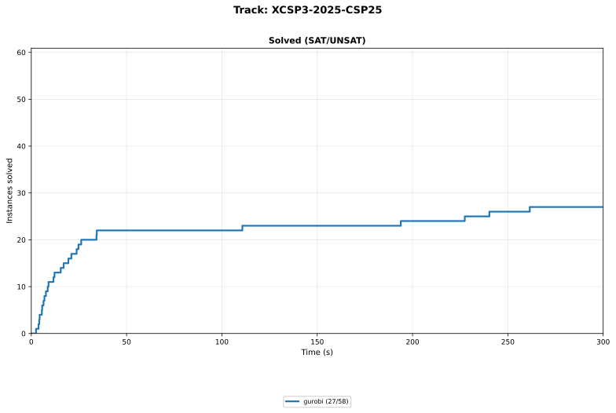

#### Solver Ranking

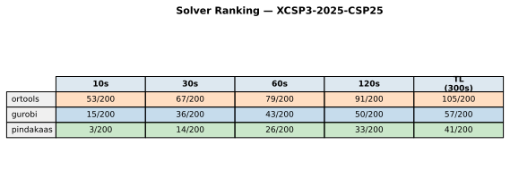

#### Solve Status

| Solver | SAT | UNSAT | TIMEOUT | OOM | ERROR | UNKNOWN | TOTAL |
|--------|-----|-------|---------|-----|-------|---------|-------|
| `gurobi` | 42 | 16 | 59 | **12** | 0 | 71 | 200 |
| `pindakaas` | 29 | 16 | 26 | **71** | 0 | 58 | 200 |

#### Solution Checker

| Solver | Valid | Invalid | Skipped | Total |
|--------|-------|---------|---------|-------|
| `gurobi` | 159 | 0 | 41 | 200 |
| `pindakaas` | 108 | 0 | 92 | 200 |

---

## xglobals Table instantiation

_Tracks: XCSP3-2025-CSP25 · cpmpy: `3b563c66 — fix regular and pass custom positives to recursive calls` · Created: 2026-06-05 19:14:02 · Last run: 2026-06-05 20:31:32_

### Track: XCSP3-2025-CSP25

#### Performance Profile

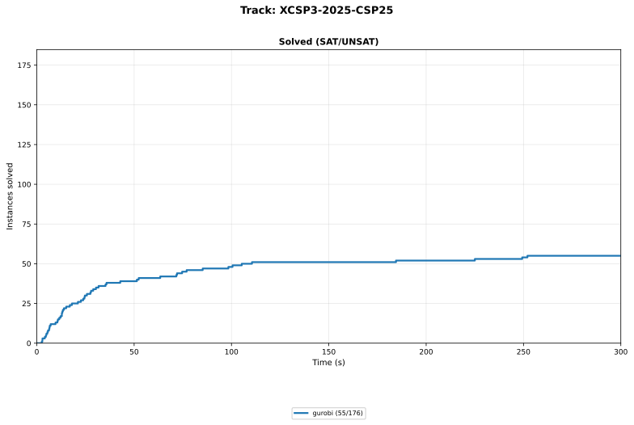

#### Solver Ranking

#### Solve Status

| Solver | SAT | UNSAT | TIMEOUT | OOM | ERROR | UNKNOWN | TOTAL |
|--------|-----|-------|---------|-----|-------|---------|-------|
| `gurobi` | 40 | 16 | 56 | **15** | 0 | 73 | 200 |
| `pindakaas` | 30 | 16 | 25 | **72** | 0 | 57 | 200 |

#### Solution Checker

| Solver | Valid | Invalid | Skipped | Total |
|--------|-------|---------|---------|-------|
| `gurobi` | 161 | 0 | 39 | 200 |
| `pindakaas` | 107 | 0 | 93 | 200 |

---

## cpmpy Table extension

_Tracks: XCSP3-2025-CSP25 · cpmpy: `3b563c66 — fix regular and pass custom positives to recursive calls` · Created: 2026-06-05 17:29:52 · Last run: 2026-06-05 18:47:25_

### Track: XCSP3-2025-CSP25

#### Performance Profile

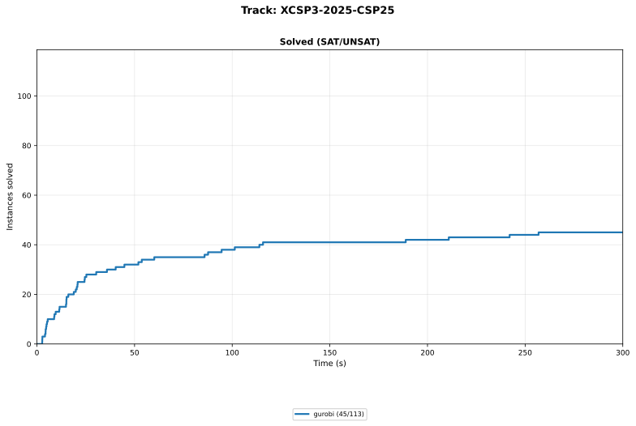

#### Solver Ranking

#### Solve Status

| Solver | SAT | UNSAT | TIMEOUT | OOM | ERROR | UNKNOWN | TOTAL |
|--------|-----|-------|---------|-----|-------|---------|-------|
| `gurobi` | 42 | 16 | 55 | **13** | 0 | 74 | 200 |
| `pindakaas` | 29 | 16 | 28 | **71** | 0 | 56 | 200 |

#### Solution Checker

| Solver | Valid | Invalid | Skipped | Total |
|--------|-------|---------|---------|-------|
| `gurobi` | 159 | 0 | 41 | 200 |
| `pindakaas` | 106 | 0 | 94 | 200 |

---

## xglobals Baseline

_Tracks: XCSP3-2025-CSP25 · cpmpy: `0e7b2159 — Fix xglobals import` · Created: 2026-06-05 15:25:25 · Last run: 2026-06-05 17:16:08_

### Track: XCSP3-2025-CSP25

#### Performance Profile

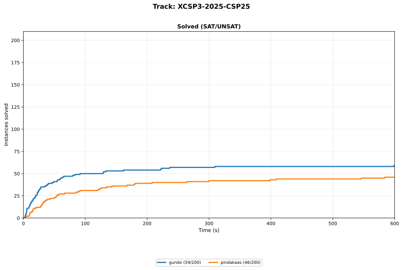

#### Solver Ranking

#### Solve Status

| Solver | SAT | UNSAT | TIMEOUT | OOM | ERROR | UNKNOWN | TOTAL |
|--------|-----|-------|---------|-----|-------|---------|-------|
| `ortools` | 87 | 27 | 3 | **11** | 0 | 72 | 200 |
| `gurobi` | 42 | 17 | 60 | **13** | 0 | 68 | 200 |
| `pindakaas` | 30 | 16 | 25 | **74** | 0 | 55 | 200 |

#### Solution Checker

| Solver | Valid | Invalid | Skipped | Total |
|--------|-------|---------|---------|-------|
| `ortools` | 188 | 0 | 12 | 200 |
| `gurobi` | 163 | 0 | 37 | 200 |
| `pindakaas` | 104 | 0 | 96 | 200 |

---

## Baseline _(running)_

_Tracks: XCSP3-2025-CSP25 · cpmpy: `3b563c66 — fix regular and pass custom positives to recursive calls` · Created: 2026-06-05 15:18:53 · Last run: —_

### Live Progress

| Solver | Track | Status | Progress | Started | Elapsed |
|--------|-------|--------|----------|---------|---------|
| `gurobi` | XCSP3-2025-CSP25 | 🔄 running | 26/200 | 2026-06-05 15:19:39 | 6h 37m |
| `pindakaas` | XCSP3-2025-CSP25 | ⏳ pending | 0/200 | — | — |

### Track: XCSP3-2025-CSP25

#### Performance Profile

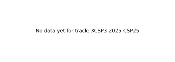

#### Solver Ranking

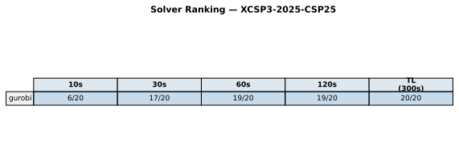

#### Solve Status

| Solver | SAT | UNSAT | TIMEOUT | OOM | ERROR | UNKNOWN | TOTAL |
|--------|-----|-------|---------|-----|-------|---------|-------|
| `gurobi` | 16 | 6 | 0 | **4** | 0 | 0 | 26 |

#### Solution Checker

| Solver | Valid | Invalid | Skipped | Total |
|--------|-------|---------|---------|-------|
| `gurobi` | 22 | 0 | 4 | 26 |

---

## Forse Regular via table (linear) _(running)_

_Tracks: XCSP3-2025-CSP25 · cpmpy: `0e7b2159 — Fix xglobals import` · Created: 2026-06-05 14:30:43 · Last run: 2026-06-05 15:06:44_

### Live Progress

| Solver | Track | Status | Progress | Started | Elapsed |
|--------|-------|--------|----------|---------|---------|
| `pindakaas` | XCSP3-2025-CSP25 | ✅ done | 200/200 | 2026-06-05 14:31:29 | — |
| `gurobi` | XCSP3-2025-CSP25 | 🔄 running | 18/200 | 2026-06-05 15:16:24 | 6h 40m |

### Track: XCSP3-2025-CSP25

#### Performance Profile

#### Solver Ranking

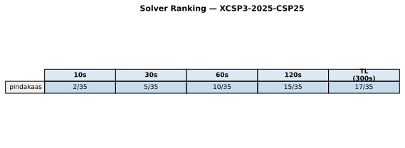

#### Solve Status

| Solver | SAT | UNSAT | TIMEOUT | OOM | ERROR | UNKNOWN | TOTAL |
|--------|-----|-------|---------|-----|-------|---------|-------|
| `pindakaas` | 30 | 16 | 23 | **73** | 0 | 58 | 200 |
| `gurobi` | 13 | 5 | 0 | 0 | 0 | 0 | 18 |

#### Solution Checker

| Solver | Valid | Invalid | Skipped | Total |
|--------|-------|---------|---------|-------|
| `pindakaas` | 106 | 0 | 94 | 200 |
| `gurobi` | 18 | 0 | 0 | 18 |

---

## Regular via table

_Tracks: XCSP3-2025-CSP25 · cpmpy: `0e7b2159 — Fix xglobals import` · Created: 2026-06-05 13:50:52 · Last run: 2026-06-05 14:27:45_

### Track: XCSP3-2025-CSP25

#### Performance Profile

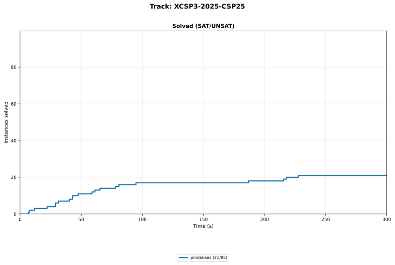

#### Solver Ranking

#### Solve Status

| Solver | SAT | UNSAT | TIMEOUT | OOM | ERROR | UNKNOWN | TOTAL |
|--------|-----|-------|---------|-----|-------|---------|-------|
| `pindakaas` | 30 | 16 | 26 | **70** | 0 | 58 | 200 |

#### Solution Checker

| Solver | Valid | Invalid | Skipped | Total |
|--------|-------|---------|---------|-------|
| `pindakaas` | 106 | 0 | 94 | 200 |

---

## Disable regular linearise

_Tracks: XCSP3-2025-CSP25 · cpmpy: `0e7b2159 — Fix xglobals import` · Created: 2026-06-05 12:34:06 · Last run: 2026-06-05 13:10:17_

### Track: XCSP3-2025-CSP25

#### Performance Profile

#### Solver Ranking

#### Solve Status

| Solver | SAT | UNSAT | TIMEOUT | OOM | ERROR | UNKNOWN | TOTAL |
|--------|-----|-------|---------|-----|-------|---------|-------|
| `pindakaas` | 31 | 16 | 28 | **73** | 0 | 52 | 200 |

#### Solution Checker

| Solver | Valid | Invalid | Skipped | Total |
|--------|-------|---------|---------|-------|
| `pindakaas` | 103 | 0 | 97 | 200 |

---

## xglobals regular

_Tracks: XCSP3-2025-CSP25 · cpmpy: `0e7b2159 — Fix xglobals import` · Created: 2026-06-05 10:58:49 · Last run: 2026-06-05 12:29:54_

### Track: XCSP3-2025-CSP25

#### Performance Profile

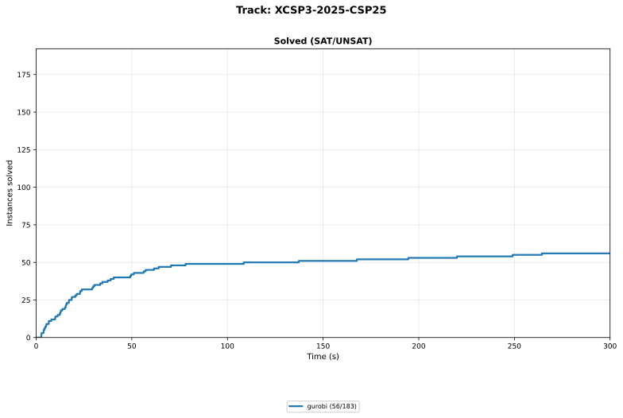

#### Solver Ranking

#### Solve Status

| Solver | SAT | UNSAT | TIMEOUT | OOM | ERROR | UNKNOWN | TOTAL |
|--------|-----|-------|---------|-----|-------|---------|-------|
| `gurobi` | 42 | 16 | 59 | **13** | 0 | 70 | 200 |
| `pindakaas` | 31 | 16 | 24 | **74** | 0 | 55 | 200 |

#### Solution Checker

| Solver | Valid | Invalid | Skipped | Total |
|--------|-------|---------|---------|-------|
| `gurobi` | 162 | 0 | 38 | 200 |
| `pindakaas` | 105 | 0 | 95 | 200 |

---

## DFA decomp regular

_Tracks: XCSP3-2025-CSP25 · cpmpy: `0e7b2159 — Fix xglobals import` · Created: 2026-06-05 09:36:53 · Last run: 2026-06-05 10:52:17_

### Track: XCSP3-2025-CSP25

#### Performance Profile

#### Solver Ranking

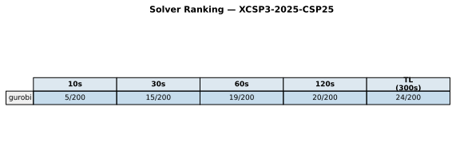

#### Solve Status

| Solver | SAT | UNSAT | TIMEOUT | OOM | ERROR | UNKNOWN | TOTAL |
|--------|-----|-------|---------|-----|-------|---------|-------|
| `gurobi` | 42 | 16 | 58 | **13** | 0 | 71 | 200 |

#### Solution Checker

| Solver | Valid | Invalid | Skipped | Total |
|--------|-------|---------|---------|-------|
| `gurobi` | 163 | 0 | 37 | 200 |

---

## Rsync fix

_Tracks: XCSP3-2025-CSP25 · cpmpy: `6e486806 — Merge remote-tracking branch 'origin/save_reification_to_csemap' into xcsp3_26` · Created: 2026-06-05 07:28:44 · Last run: 2026-06-05 09:20:36_

### Track: XCSP3-2025-CSP25

#### Performance Profile

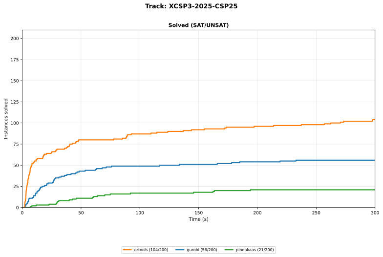

#### Solver Ranking

#### Solve Status

| Solver | SAT | UNSAT | TIMEOUT | OOM | ERROR | UNKNOWN | TOTAL |
|--------|-----|-------|---------|-----|-------|---------|-------|
| `ortools` | 87 | 27 | 2 | **11** | 0 | 73 | 200 |
| `gurobi` | 42 | 16 | 67 | **8** | 0 | 67 | 200 |
| `pindakaas` | 35 | 16 | 35 | **62** | 0 | 52 | 200 |

#### Solution Checker

| Solver | Valid | Invalid | Skipped | Total |
|--------|-------|---------|---------|-------|
| `ortools` | 188 | 0 | 12 | 200 |
| `gurobi` | 165 | 0 | 35 | 200 |
| `pindakaas` | 111 | 0 | 89 | 200 |

---

## New New Baseline Final Sprint (CSE map fix)

_Tracks: XCSP3-2025-CSP25 · cpmpy: `009dbfd9 — Revert "Selective channels linear solvers xcsp3 (#1008)"` · Created: 2026-06-05 01:33:41 · Last run: 2026-06-05 04:59:35_

### Track: XCSP3-2025-CSP25

#### Performance Profile

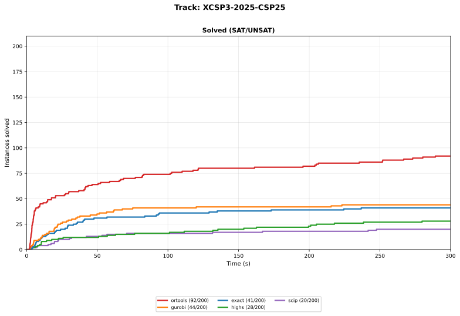

#### Solver Ranking

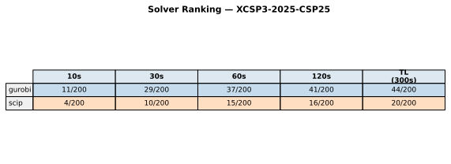

#### Solve Status

| Solver | SAT | UNSAT | TIMEOUT | OOM | ERROR | UNKNOWN | TOTAL |
|--------|-----|-------|---------|-----|-------|---------|-------|
| `ortools` | 76 | 24 | 5 | **11** | **14** | 70 | 200 |
| `exact` | 35 | 13 | 63 | **10** | **44** | 35 | 200 |
| `gurobi` | 31 | 14 | 38 | **3** | **44** | 70 | 200 |
| `highs` | 21 | 10 | 45 | **12** | **44** | 68 | 200 |
| `pindakaas` | 17 | 13 | 22 | **55** | **44** | 49 | 200 |
| `scip` | 14 | 11 | 56 | **20** | **47** | 52 | 200 |

#### Solution Checker

| Solver | Valid | Invalid | Skipped | Total |
|--------|-------|---------|---------|-------|
| `ortools` | 174 | 0 | 26 | 200 |
| `exact` | 86 | 0 | 114 | 200 |
| `gurobi` | 136 | 0 | 64 | 200 |
| `highs` | 103 | 0 | 97 | 200 |
| `pindakaas` | 82 | 0 | 118 | 200 |
| `scip` | 95 | 0 | 105 | 200 |

---

## New Baseline Final Sprint _(running)_

_Tracks: XCSP3-2025-CSP25 · cpmpy: `009dbfd9 — Revert "Selective channels linear solvers xcsp3 (#1008)"` · Created: 2026-06-05 00:45:59 · Last run: 2026-06-05 01:20:39_

### Live Progress

| Solver | Track | Status | Progress | Started | Elapsed |
|--------|-------|--------|----------|---------|---------|
| `gurobi` | XCSP3-2025-CSP25 | ✅ done | 200/200 | 2026-06-05 00:46:42 | — |
| `scip` | XCSP3-2025-CSP25 | ❌ error | 21/200 | 2026-06-05 01:21:16 | — |
| `exact` | XCSP3-2025-CSP25 | ⏳ pending | 0/200 | — | — |
| `highs` | XCSP3-2025-CSP25 | ⏳ pending | 0/200 | — | — |
| `ortools` | XCSP3-2025-CSP25 | ⏳ pending | 0/200 | — | — |

### Track: XCSP3-2025-CSP25

#### Performance Profile

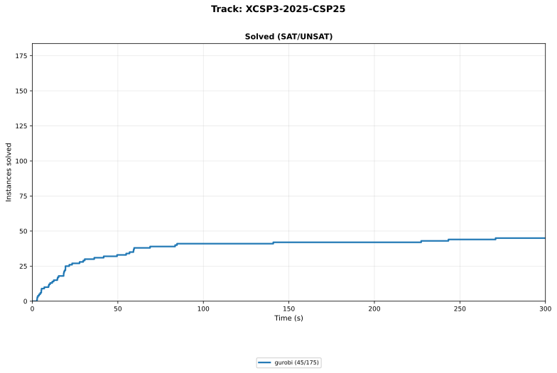

#### Solver Ranking

#### Solve Status

| Solver | SAT | UNSAT | TIMEOUT | OOM | ERROR | UNKNOWN | TOTAL |
|--------|-----|-------|---------|-----|-------|---------|-------|
| `gurobi` | 31 | 15 | 41 | **3** | **44** | 66 | 200 |
| `scip` | 11 | 4 | 0 | **2** | **3** | 1 | 21 |

#### Solution Checker

| Solver | Valid | Invalid | Skipped | Total |
|--------|-------|---------|---------|-------|
| `gurobi` | 136 | 0 | 64 | 200 |
| `scip` | 15 | 0 | 6 | 21 |

---

## Undo selective channels linear solvers

_Tracks: XCSP3-2025-CSP25, unknown · cpmpy: `—` · Created: 2026-06-05 00:10:48 · Last run: —_

### Track: XCSP3-2025-CSP25

#### Performance Profile

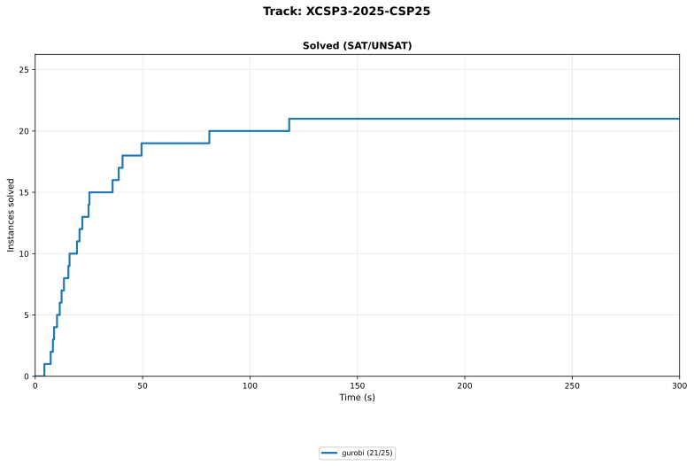

#### Solver Ranking

#### Solve Status

| Solver | SAT | UNSAT | TIMEOUT | OOM | ERROR | UNKNOWN | TOTAL |
|--------|-----|-------|---------|-----|-------|---------|-------|
| `gurobi` | 17 | 7 | 0 | **2** | **3** | 0 | 29 |

#### Solution Checker

| Solver | Valid | Invalid | Skipped | Total |
|--------|-------|---------|---------|-------|
| `gurobi` | 24 | 0 | 5 | 29 |

### Track: unknown

#### Performance Profile

#### Solver Ranking

#### Solve Status

_No results yet._

#### Solution Checker

_Solution checker not enabled._

---

## Safe reification to CSE map _(running)_

_Tracks: XCSP3-2025-CSP25 · cpmpy: `efee012c — Merge remote-tracking branch 'origin/save_reification_to_csemap' into xcsp3_26` · Created: 2026-06-04 22:31:23 · Last run: 2026-06-05 00:08:22_

### Live Progress

| Solver | Track | Status | Progress | Started | Elapsed |
|--------|-------|--------|----------|---------|---------|
| `exact` | XCSP3-2025-CSP25 | ✅ done | 200/200 | 2026-06-04 23:05:03 | — |
| `gurobi` | XCSP3-2025-CSP25 | ✅ done | 200/200 | 2026-06-04 22:32:10 | — |
| `pindakaas` | XCSP3-2025-CSP25 | ✅ done | 200/200 | 2026-06-04 23:38:29 | — |
| `highs` | XCSP3-2025-CSP25 | ❌ error | 4/200 | 2026-06-05 00:09:07 | — |
| `ortools` | XCSP3-2025-CSP25 | ⏳ pending | 0/200 | — | — |
| `scip` | XCSP3-2025-CSP25 | ⏳ pending | 0/200 | — | — |

### Track: XCSP3-2025-CSP25

#### Performance Profile

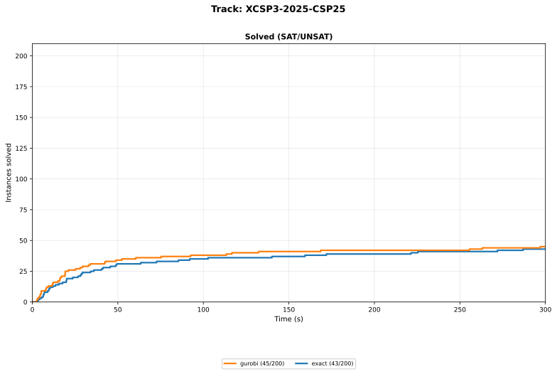

#### Solver Ranking

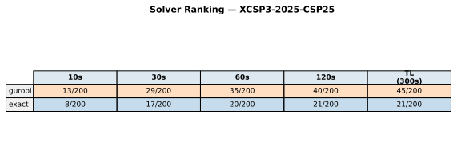

#### Solve Status

| Solver | SAT | UNSAT | TIMEOUT | OOM | ERROR | UNKNOWN | TOTAL |
|--------|-----|-------|---------|-----|-------|---------|-------|
| `exact` | 35 | 13 | 71 | **5** | **44** | 32 | 200 |
| `gurobi` | 31 | 15 | 38 | **5** | **44** | 67 | 200 |
| `pindakaas` | 17 | 13 | 24 | **57** | **44** | 45 | 200 |
| `highs` | 2 | 1 | 0 | 0 | 0 | 1 | 4 |

#### Solution Checker

| Solver | Valid | Invalid | Skipped | Total |
|--------|-------|---------|---------|-------|
| `exact` | 85 | 0 | 115 | 200 |
| `gurobi` | 133 | 0 | 67 | 200 |
| `pindakaas` | 78 | 0 | 122 | 200 |
| `highs` | 3 | 0 | 1 | 4 |

---

## Baseline Final Sprint _(running)_

_Tracks: XCSP3-2025-CSP25 · cpmpy: `009dbfd9 — Revert "Selective channels linear solvers xcsp3 (#1008)"` · Created: 2026-06-04 17:47:37 · Last run: 2026-06-05 00:45:02_

### Live Progress

| Solver | Track | Status | Progress | Started | Elapsed |
|--------|-------|--------|----------|---------|---------|
| `gurobi` | XCSP3-2025-CSP25 | ✅ done | 200/200 | 2026-06-04 17:48:24 | — |
| `exact` | XCSP3-2025-CSP25 | ⏳ pending | 0/200 | — | — |
| `highs` | XCSP3-2025-CSP25 | ⏳ pending | 0/200 | — | — |
| `ortools` | XCSP3-2025-CSP25 | ⏳ pending | 0/200 | — | — |
| `scip` | XCSP3-2025-CSP25 | ⏳ pending | 0/200 | — | — |

### Track: XCSP3-2025-CSP25

#### Performance Profile

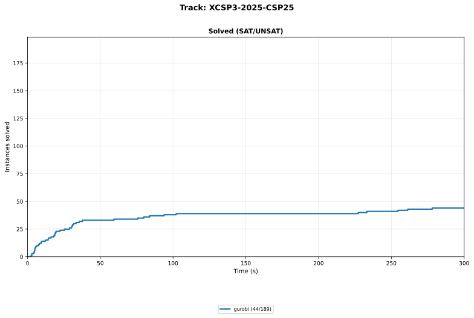

#### Solver Ranking

#### Solve Status

| Solver | SAT | UNSAT | TIMEOUT | OOM | ERROR | UNKNOWN | TOTAL |
|--------|-----|-------|---------|-----|-------|---------|-------|
| `gurobi` | 31 | 14 | 39 | **5** | **44** | 67 | 200 |

#### Solution Checker

| Solver | Valid | Invalid | Skipped | Total |
|--------|-------|---------|---------|-------|
| `gurobi` | 134 | 0 | 66 | 200 |

---

## Ablation - Positive Circuit

_Tracks: XCSP3-2025-CSP25 · cpmpy: `ea0687dd — Positive circuit` · Created: 2026-06-04 06:45:57 · Last run: 2026-06-04 09:02:33_

### Track: XCSP3-2025-CSP25

#### Performance Profile

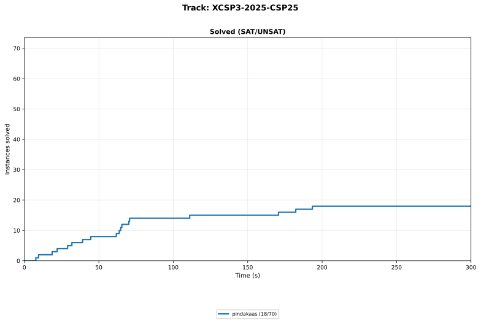

#### Solver Ranking

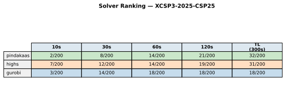

#### Solve Status

| Solver | SAT | UNSAT | TIMEOUT | OOM | ERROR | UNKNOWN | TOTAL |
|--------|-----|-------|---------|-----|-------|---------|-------|
| `gurobi` | 39 | 22 | 50 | **10** | **14** | 65 | 200 |
| `pindakaas` | 26 | 13 | 33 | **60** | **14** | 54 | 200 |
| `highs` | 25 | 10 | 63 | **15** | **14** | 73 | 200 |

#### Solution Checker

| Solver | Valid | Invalid | Skipped | Total |
|--------|-------|---------|---------|-------|
| `gurobi` | 147 | 0 | 53 | 200 |
| `pindakaas` | 100 | 0 | 100 | 200 |
| `highs` | 111 | 0 | 89 | 200 |

---

## Ablation - NonReifiedTable for instantiation

_Tracks: XCSP3-2025-CSP25 · cpmpy: `2ab26260 — Revert based on ablation` · Created: 2026-06-03 23:44:44 · Last run: 2026-06-04 00:21:17_

### Track: XCSP3-2025-CSP25

#### Performance Profile

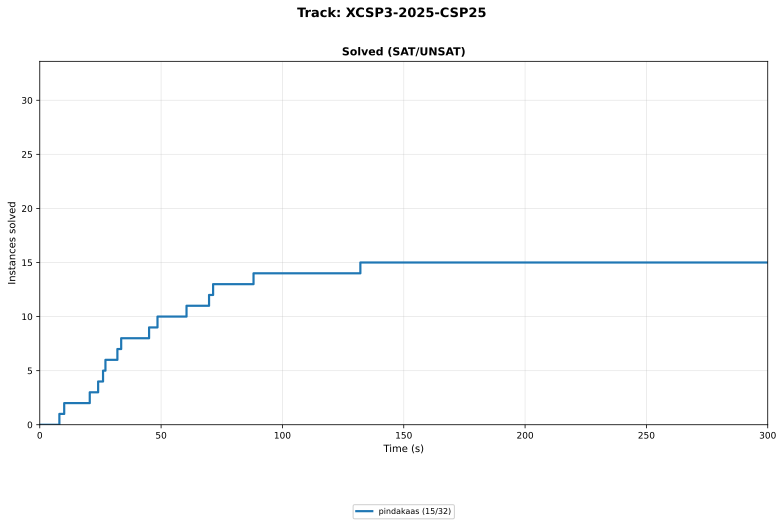

#### Solver Ranking

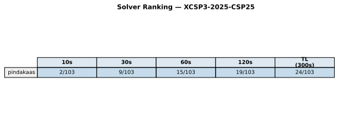

#### Solve Status

| Solver | SAT | UNSAT | TIMEOUT | OOM | ERROR | UNKNOWN | TOTAL |
|--------|-----|-------|---------|-----|-------|---------|-------|
| `pindakaas` | 26 | 12 | 31 | **61** | **14** | 56 | 200 |

#### Solution Checker

| Solver | Valid | Invalid | Skipped | Total |
|--------|-------|---------|---------|-------|
| `pindakaas` | 102 | 0 | 98 | 200 |

---

## Ablation - Disable Regular in linearize

_Tracks: XCSP3-2025-CSP25 · cpmpy: `2ab26260 — Revert based on ablation` · Created: 2026-06-03 22:57:17 · Last run: 2026-06-03 23:34:28_

### Track: XCSP3-2025-CSP25

#### Performance Profile

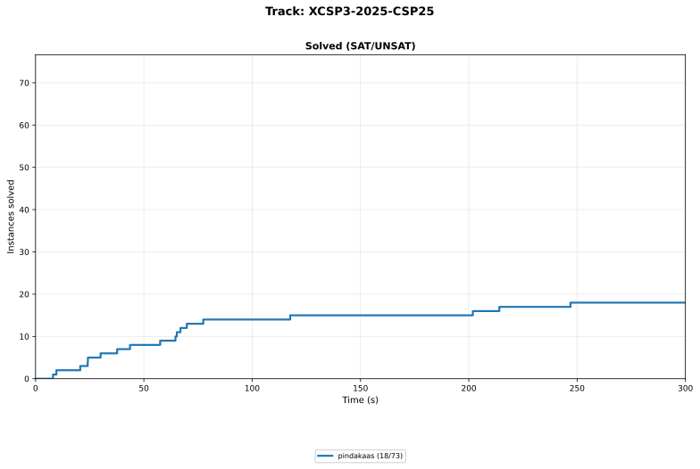

#### Solver Ranking

#### Solve Status

| Solver | SAT | UNSAT | TIMEOUT | OOM | ERROR | UNKNOWN | TOTAL |
|--------|-----|-------|---------|-----|-------|---------|-------|
| `pindakaas` | 26 | 13 | 31 | **63** | **14** | 53 | 200 |

#### Solution Checker

| Solver | Valid | Invalid | Skipped | Total |
|--------|-------|---------|---------|-------|
| `pindakaas` | 95 | 0 | 105 | 200 |

---

## Ablation - Revert

_Tracks: XCSP3-2025-CSP25 · cpmpy: `2ab26260 — Revert based on ablation` · Created: 2026-06-03 22:13:16 · Last run: 2026-06-03 22:49:53_

### Track: XCSP3-2025-CSP25

#### Performance Profile

#### Solver Ranking

#### Solve Status

| Solver | SAT | UNSAT | TIMEOUT | OOM | ERROR | UNKNOWN | TOTAL |
|--------|-----|-------|---------|-----|-------|---------|-------|
| `pindakaas` | 21 | 13 | 26 | **69** | **14** | 57 | 200 |

#### Solution Checker

| Solver | Valid | Invalid | Skipped | Total |
|--------|-------|---------|---------|-------|
| `pindakaas` | 94 | 0 | 106 | 200 |

---

## Ablation - Linear Regular

_Tracks: XCSP3-2025-CSP25 · cpmpy: `76d54ede — Lost in merge` · Created: 2026-06-03 21:17:18 · Last run: 2026-06-03 21:53:49_

### Track: XCSP3-2025-CSP25

#### Performance Profile

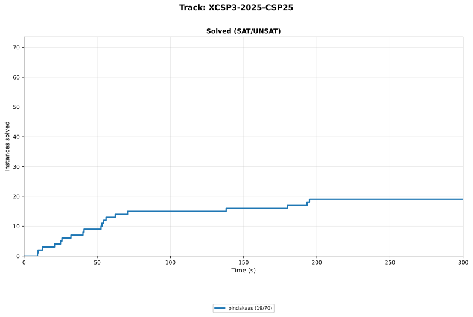

#### Solver Ranking

#### Solve Status

| Solver | SAT | UNSAT | TIMEOUT | OOM | ERROR | UNKNOWN | TOTAL |
|--------|-----|-------|---------|-----|-------|---------|-------|
| `pindakaas` | 21 | 13 | 29 | **73** | **14** | 50 | 200 |

#### Solution Checker

| Solver | Valid | Invalid | Skipped | Total |
|--------|-------|---------|---------|-------|
| `pindakaas` | 89 | 0 | 111 | 200 |

---

## Ablation - Positive ShortTable

_Tracks: XCSP3-2025-CSP25 · cpmpy: `8080fcba — Remove duplicate solution row selecting var` · Created: 2026-06-03 20:29:41 · Last run: 2026-06-03 21:07:06_

### Track: XCSP3-2025-CSP25

#### Performance Profile

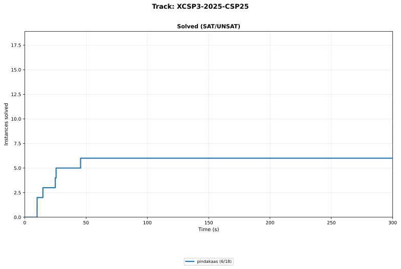

#### Solver Ranking

#### Solve Status

| Solver | SAT | UNSAT | TIMEOUT | OOM | ERROR | UNKNOWN | TOTAL |
|--------|-----|-------|---------|-----|-------|---------|-------|
| `pindakaas` | 26 | 13 | 34 | **60** | **14** | 53 | 200 |

#### Solution Checker

| Solver | Valid | Invalid | Skipped | Total |
|--------|-------|---------|---------|-------|
| `pindakaas` | 96 | 0 | 104 | 200 |

---

## Ablation - Table in Regular

_Tracks: XCSP3-2025-CSP25 · cpmpy: `137dfa9a — Rename linear to positive` · Created: 2026-06-03 19:33:16 · Last run: 2026-06-03 20:09:15_

### Track: XCSP3-2025-CSP25

#### Performance Profile

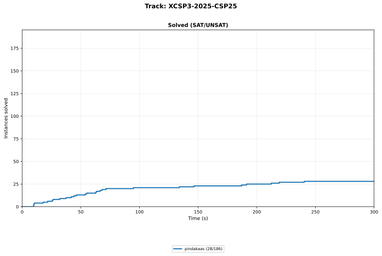

#### Solver Ranking

#### Solve Status

| Solver | SAT | UNSAT | TIMEOUT | OOM | ERROR | UNKNOWN | TOTAL |
|--------|-----|-------|---------|-----|-------|---------|-------|
| `pindakaas` | 23 | 12 | 26 | **71** | **14** | 54 | 200 |

#### Solution Checker

| Solver | Valid | Invalid | Skipped | Total |
|--------|-------|---------|---------|-------|
| `pindakaas` | 93 | 0 | 107 | 200 |

---

## Ablation - NonReifiedTable in Regular and AllDifferentListsExceptN

_Tracks: XCSP3-2025-CSP25 · cpmpy: `137dfa9a — Rename linear to positive` · Created: 2026-06-03 18:42:46 · Last run: 2026-06-03 19:19:51_

### Track: XCSP3-2025-CSP25

#### Performance Profile

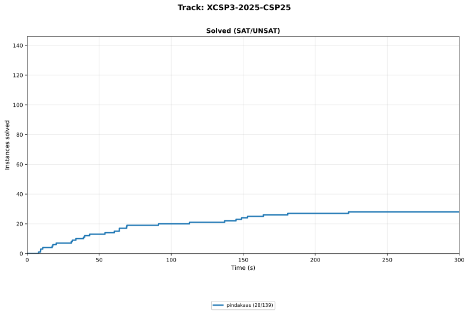

#### Solver Ranking

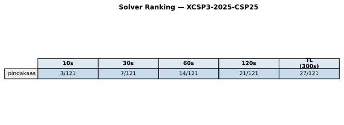

#### Solve Status

| Solver | SAT | UNSAT | TIMEOUT | OOM | ERROR | UNKNOWN | TOTAL |
|--------|-----|-------|---------|-----|-------|---------|-------|
| `pindakaas` | 26 | 13 | 33 | **61** | **14** | 53 | 200 |

#### Solution Checker

| Solver | Valid | Invalid | Skipped | Total |
|--------|-------|---------|---------|-------|
| `pindakaas` | 97 | 0 | 103 | 200 |

---

## Ablation - Positive Table

_Tracks: XCSP3-2025-CSP25 · cpmpy: `137dfa9a — Rename linear to positive` · Created: 2026-06-03 17:59:37 · Last run: 2026-06-03 18:36:03_

### Track: XCSP3-2025-CSP25

#### Performance Profile

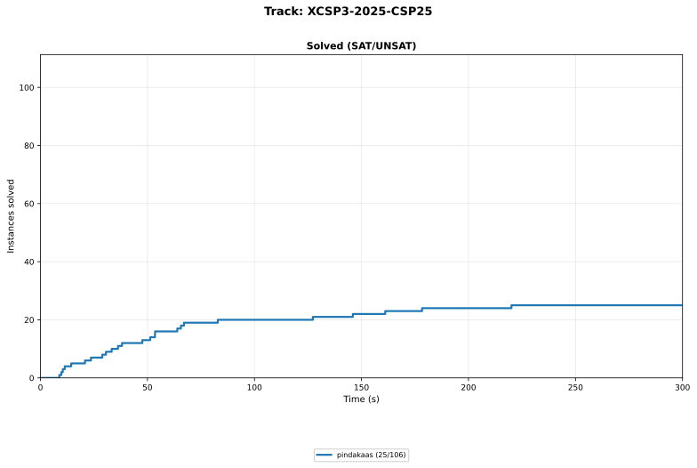

#### Solver Ranking

#### Solve Status

| Solver | SAT | UNSAT | TIMEOUT | OOM | ERROR | UNKNOWN | TOTAL |
|--------|-----|-------|---------|-----|-------|---------|-------|
| `pindakaas` | 23 | 12 | 31 | **73** | **14** | 47 | 200 |

#### Solution Checker

| Solver | Valid | Invalid | Skipped | Total |
|--------|-------|---------|---------|-------|
| `pindakaas` | 88 | 0 | 112 | 200 |

---

## Stronger GCC - rerun

_Tracks: XCSP3-2025-CSP25 · cpmpy: `2023f924 — Merge remote-tracking branch 'origin/stronger_gcc_decomp' into xcsp3_26` · Created: 2026-06-03 17:00:30 · Last run: 2026-06-03 17:37:26_

### Track: XCSP3-2025-CSP25

#### Performance Profile

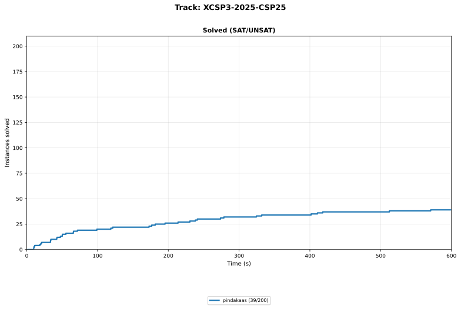

#### Solver Ranking

#### Solve Status

| Solver | SAT | UNSAT | TIMEOUT | OOM | ERROR | UNKNOWN | TOTAL |
|--------|-----|-------|---------|-----|-------|---------|-------|
| `pindakaas` | 26 | 13 | 35 | **59** | **14** | 53 | 200 |

#### Solution Checker

| Solver | Valid | Invalid | Skipped | Total |
|--------|-------|---------|---------|-------|
| `pindakaas` | 99 | 0 | 101 | 200 |

---

## Revert Positive Table

_Tracks: XCSP3-2025-CSP25 · cpmpy: `57419228 — Revert "Table"` · Created: 2026-06-03 16:20:59 · Last run: 2026-06-03 16:52:13_

### Track: XCSP3-2025-CSP25

#### Performance Profile

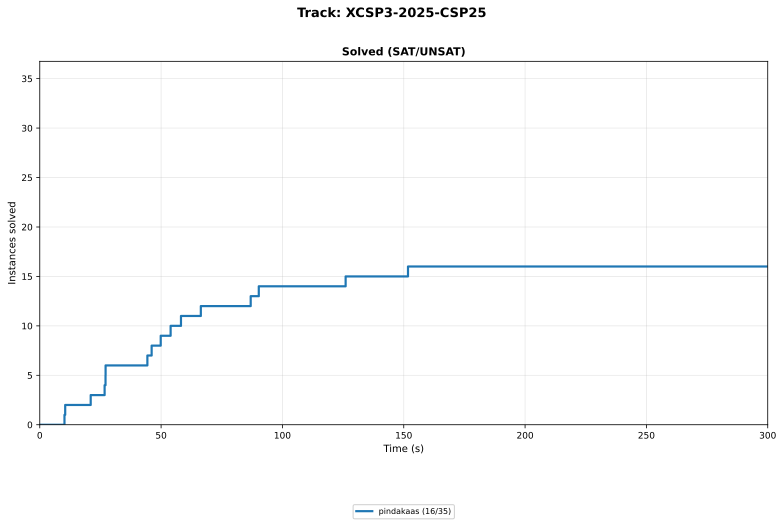

#### Solver Ranking

#### Solve Status

| Solver | SAT | UNSAT | TIMEOUT | OOM | ERROR | UNKNOWN | TOTAL |
|--------|-----|-------|---------|-----|-------|---------|-------|
| `pindakaas` | 17 | 13 | 24 | **55** | **44** | 47 | 200 |

#### Solution Checker

| Solver | Valid | Invalid | Skipped | Total |
|--------|-------|---------|---------|-------|
| `pindakaas` | 78 | 0 | 122 | 200 |

---

## Restore ShortTable

_Tracks: XCSP3-2025-CSP25 · cpmpy: `5c385788 — Restore competition regular` · Created: 2026-06-03 14:25:06 · Last run: 2026-06-03 16:06:34_

### Track: XCSP3-2025-CSP25

#### Performance Profile

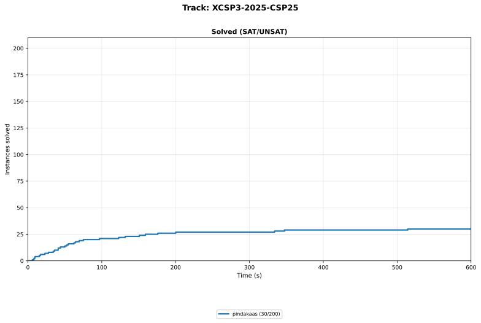

#### Solver Ranking

#### Solve Status

| Solver | SAT | UNSAT | TIMEOUT | OOM | ERROR | UNKNOWN | TOTAL |
|--------|-----|-------|---------|-----|-------|---------|-------|
| `pindakaas` | 23 | 13 | 24 | **70** | **14** | 56 | 200 |

#### Solution Checker

| Solver | Valid | Invalid | Skipped | Total |
|--------|-------|---------|---------|-------|
| `pindakaas` | 96 | 0 | 104 | 200 |

---

## Restore Regular _(running)_

_Tracks: XCSP3-2025-CSP25 · cpmpy: `5c385788 — Restore competition regular` · Created: 2026-06-03 13:26:22 · Last run: 2026-06-03 14:02:23_

### Live Progress

| Solver | Track | Status | Progress | Started | Elapsed |
|--------|-------|--------|----------|---------|---------|
| `exact` | XCSP3-2025-CSP25 | 🔄 running | 117/200 | 2026-06-03 14:03:02 | 55h 53m |
| `pindakaas` | XCSP3-2025-CSP25 | ✅ done | 200/200 | 2026-06-03 13:27:02 | — |
| `cpo` | XCSP3-2025-CSP25 | ⏳ pending | 0/200 | — | — |
| `gurobi` | XCSP3-2025-CSP25 | ⏳ pending | 0/200 | — | — |
| `highs` | XCSP3-2025-CSP25 | ⏳ pending | 0/200 | — | — |
| `ortools` | XCSP3-2025-CSP25 | ⏳ pending | 0/200 | — | — |
| `pumpkin` | XCSP3-2025-CSP25 | ⏳ pending | 0/200 | — | — |
| `scip` | XCSP3-2025-CSP25 | ⏳ pending | 0/200 | — | — |
| `z3` | XCSP3-2025-CSP25 | ⏳ pending | 0/200 | — | — |

### Track: XCSP3-2025-CSP25

#### Performance Profile

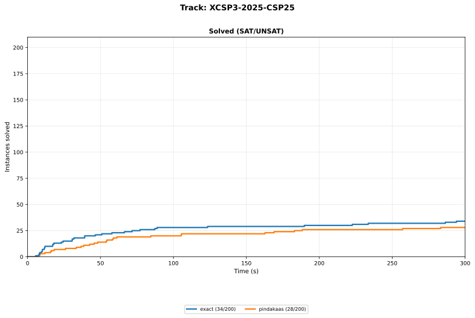

#### Solver Ranking

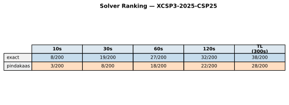

#### Solve Status

| Solver | SAT | UNSAT | TIMEOUT | OOM | ERROR | UNKNOWN | TOTAL |
|--------|-----|-------|---------|-----|-------|---------|-------|
| `exact` | 39 | 13 | 34 | **6** | 0 | 25 | 117 |
| `pindakaas` | 22 | 13 | 36 | **66** | **14** | 49 | 200 |

#### Solution Checker

| Solver | Valid | Invalid | Skipped | Total |
|--------|-------|---------|---------|-------|
| `exact` | 80 | 0 | 37 | 117 |
| `pindakaas` | 88 | 0 | 112 | 200 |

---

## Positive globals _(running)_

_Tracks: XCSP3-2025-CSP25 · cpmpy: `12444731 — Merge remote-tracking branch 'origin/positive_globals' into xcsp3_26` · Created: 2026-06-03 10:16:38 · Last run: 2026-06-03 13:15:48_

### Live Progress

| Solver | Track | Status | Progress | Started | Elapsed |
|--------|-------|--------|----------|---------|---------|
| `ortools` | XCSP3-2025-CSP25 | ✅ done | 200/200 | 2026-06-03 11:34:19 | — |
| `cpo` | XCSP3-2025-CSP25 | ✅ done | 200/200 | 2026-06-03 12:42:14 | — |
| `gurobi` | XCSP3-2025-CSP25 | ✅ done | 200/200 | 2026-06-03 12:04:41 | — |
| `exact` | XCSP3-2025-CSP25 | ✅ done | 200/200 | 2026-06-03 10:53:33 | — |
| `pindakaas` | XCSP3-2025-CSP25 | ✅ done | 200/200 | 2026-06-03 10:17:16 | — |
| `pumpkin` | XCSP3-2025-CSP25 | ❌ error | 41/200 | 2026-06-03 13:16:25 | — |
| `highs` | XCSP3-2025-CSP25 | ⏳ pending | 0/200 | — | — |
| `scip` | XCSP3-2025-CSP25 | ⏳ pending | 0/200 | — | — |
| `z3` | XCSP3-2025-CSP25 | ⏳ pending | 0/200 | — | — |

### Track: XCSP3-2025-CSP25

#### Performance Profile

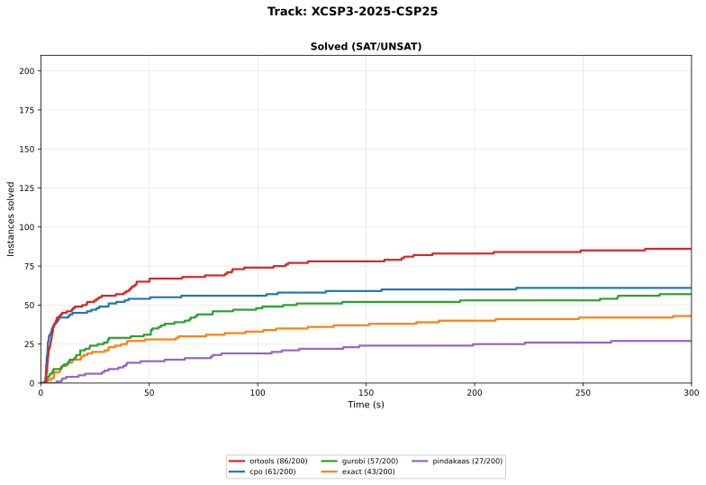

#### Solver Ranking

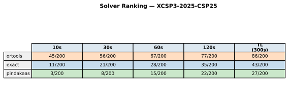

#### Solve Status

| Solver | SAT | UNSAT | TIMEOUT | OOM | ERROR | UNKNOWN | TOTAL |
|--------|-----|-------|---------|-----|-------|---------|-------|
| `ortools` | 75 | 24 | 5 | **10** | **14** | 72 | 200 |
| `cpo` | 63 | 9 | 11 | **18** | **14** | 85 | 200 |
| `gurobi` | 37 | 21 | 42 | **19** | **14** | 67 | 200 |
| `exact` | 38 | 13 | 82 | **21** | **14** | 32 | 200 |
| `pindakaas` | 20 | 12 | 32 | **67** | **14** | 55 | 200 |
| `pumpkin` | 22 | 4 | 0 | **4** | **11** | 0 | 41 |

#### Solution Checker

| Solver | Valid | Invalid | Skipped | Total |
|--------|-------|---------|---------|-------|
| `ortools` | 174 | 0 | 26 | 200 |
| `cpo` | 160 | 0 | 40 | 200 |
| `gurobi` | 150 | 0 | 50 | 200 |
| `exact` | 87 | 0 | 113 | 200 |
| `pindakaas` | 89 | 0 | 111 | 200 |
| `pumpkin` | 26 | 0 | 15 | 41 |

---

## Stronger GCC decomp

_Tracks: XCSP3-2025-CSP25 · cpmpy: `2023f924 — Merge remote-tracking branch 'origin/stronger_gcc_decomp' into xcsp3_26` · Created: 2026-06-03 00:12:37 · Last run: 2026-06-03 06:02:46_

### Track: XCSP3-2025-CSP25

#### Performance Profile

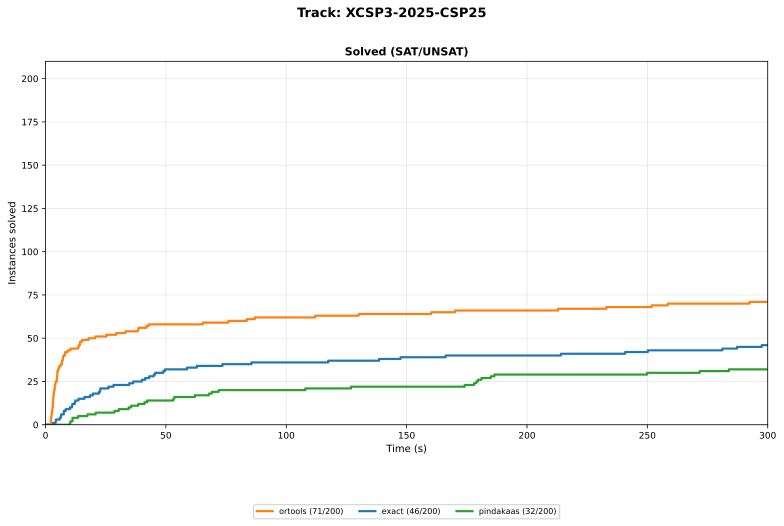

#### Solver Ranking

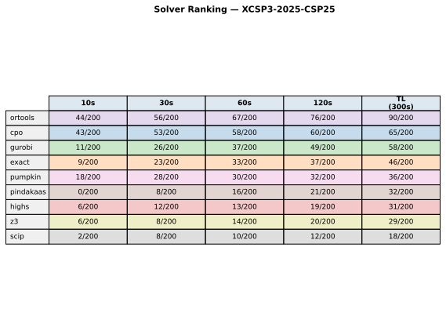

#### Solve Status

| Solver | SAT | UNSAT | TIMEOUT | OOM | ERROR | UNKNOWN | TOTAL |
|--------|-----|-------|---------|-----|-------|---------|-------|
| `ortools` | 76 | 25 | 5 | **10** | **14** | 70 | 200 |
| `cpo` | 63 | 9 | 10 | **6** | **14** | 98 | 200 |
| `gurobi` | 39 | 22 | 52 | **8** | **14** | 65 | 200 |
| `exact` | 39 | 13 | 95 | **9** | **14** | 30 | 200 |
| `pumpkin` | 36 | 6 | 28 | **7** | **25** | 98 | 200 |
| `pindakaas` | 26 | 13 | 30 | **62** | **14** | 55 | 200 |
| `z3` | 26 | 13 | 19 | **14** | **14** | 114 | 200 |
| `highs` | 25 | 10 | 63 | **16** | **14** | 72 | 200 |
| `scip` | 17 | 8 | 58 | **37** | **17** | 63 | 200 |

#### Solution Checker

| Solver | Valid | Invalid | Skipped | Total |
|--------|-------|---------|---------|-------|
| `ortools` | 174 | 0 | 26 | 200 |
| `cpo` | 175 | 0 | 25 | 200 |
| `gurobi` | 154 | 0 | 46 | 200 |
| `exact` | 85 | 0 | 115 | 200 |
| `pumpkin` | 168 | 0 | 32 | 200 |
| `pindakaas` | 98 | 0 | 102 | 200 |
| `z3` | 164 | 0 | 36 | 200 |
| `highs` | 113 | 0 | 87 | 200 |
| `scip` | 110 | 0 | 90 | 200 |

---

## Selective channeling

_Tracks: XCSP3-2025-COP25, XCSP3-2025-CSP25 · cpmpy: `7dcaa8e2 — Merge remote-tracking branch 'origin/xcsp3_26' into xcsp3_26` · Created: 2026-06-02 14:24:42 · Last run: 2026-06-02 23:38:46_

### Track: XCSP3-2025-CSP25

#### Performance Profile

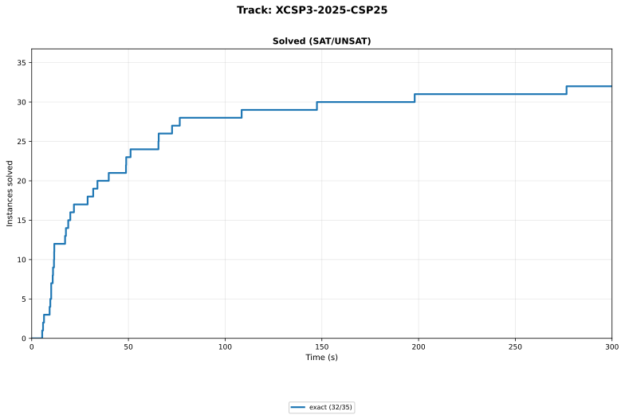

#### Solver Ranking

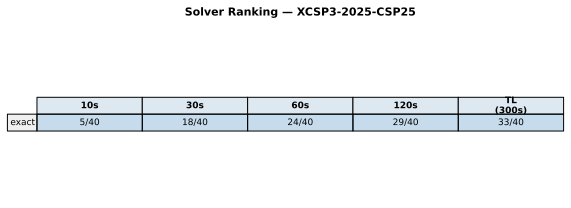

#### Solve Status

| Solver | SAT | UNSAT | TIMEOUT | OOM | ERROR | UNKNOWN | TOTAL |
|--------|-----|-------|---------|-----|-------|---------|-------|
| `exact` | 40 | 13 | 81 | **13** | **14** | 39 | 200 |

#### Solution Checker

| Solver | Valid | Invalid | Skipped | Total |
|--------|-------|---------|---------|-------|
| `exact` | 98 | 0 | 102 | 200 |

### Track: XCSP3-2025-COP25

#### Performance Profile

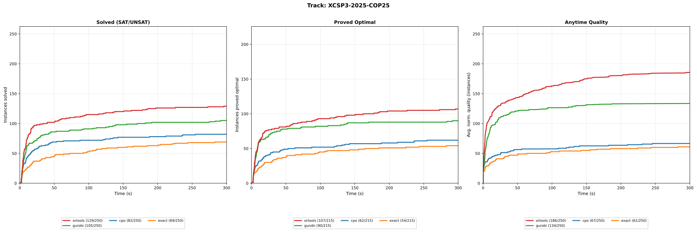

#### Solver Ranking

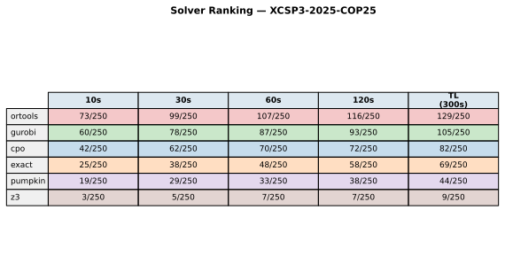

#### Solve Status

| Solver | SAT | UNSAT | TIMEOUT | OOM | ERROR | UNKNOWN | TOTAL |
|--------|-----|-------|---------|-----|-------|---------|-------|
| `ortools` | 201 | 22 | 1 | **13** | 0 | 13 | 250 |
| `cpo` | 164 | 20 | 36 | **15** | 0 | 15 | 250 |
| `gurobi` | 147 | 17 | 38 | **25** | 0 | 23 | 250 |
| `highs` | 115 | 12 | 76 | **20** | 0 | 27 | 250 |
| `z3` | 97 | 16 | 57 | **30** | **15** | 35 | 250 |
| `scip` | 100 | 12 | 54 | **43** | **14** | 27 | 250 |
| `exact` | 88 | 17 | 119 | **21** | 0 | 5 | 250 |
| `pumpkin` | 103 | 0 | 25 | **25** | **64** | 33 | 250 |

#### Solution Checker

| Solver | Valid | Invalid | Skipped | Total |
|--------|-------|---------|---------|-------|
| `ortools` | 226 | 0 | 24 | 250 |
| `cpo` | 191 | 0 | 59 | 250 |
| `gurobi` | 185 | 0 | 65 | 250 |
| `highs` | 166 | 0 | 84 | 250 |
| `z3` | 171 | 0 | 79 | 250 |
| `scip` | 147 | 0 | 103 | 250 |
| `exact` | 112 | 0 | 138 | 250 |
| `pumpkin` | 153 | 0 | 97 | 250 |

---

## Exact SoPlex

_Tracks: XCSP3-2025-CSP25 · cpmpy: `009a736d — Merge remote-tracking branch 'origin/master' into xcsp3_26` · Created: 2026-06-02 11:49:55 · Last run: 2026-06-02 12:31:07_

### Track: XCSP3-2025-CSP25

#### Performance Profile

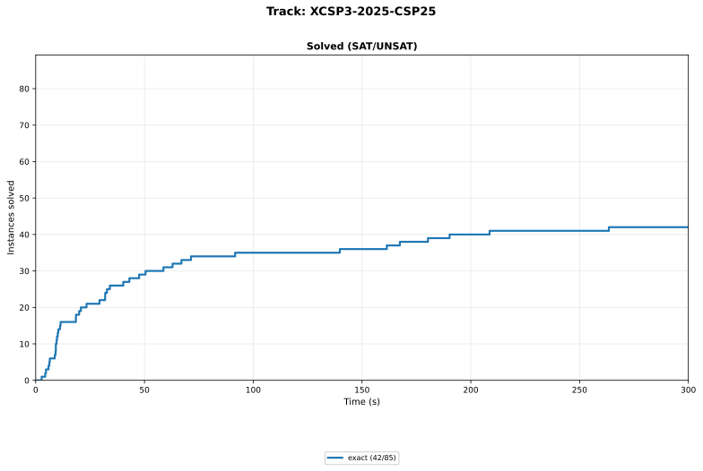

#### Solver Ranking

#### Solve Status

| Solver | SAT | UNSAT | TIMEOUT | OOM | ERROR | UNKNOWN | TOTAL |
|--------|-----|-------|---------|-----|-------|---------|-------|
| `exact` | 39 | 13 | 94 | **14** | **14** | 26 | 200 |

#### Solution Checker

| Solver | Valid | Invalid | Skipped | Total |
|--------|-------|---------|---------|-------|
| `exact` | 87 | 0 | 113 | 200 |

---

## Positive decomposition

_Tracks: XCSP3-2025-CSP25 · cpmpy: `009a736d — Merge remote-tracking branch 'origin/master' into xcsp3_26` · Created: 2026-06-02 00:12:55 · Last run: 2026-06-02 05:19:43_

### Track: XCSP3-2025-CSP25

#### Performance Profile

#### Solver Ranking

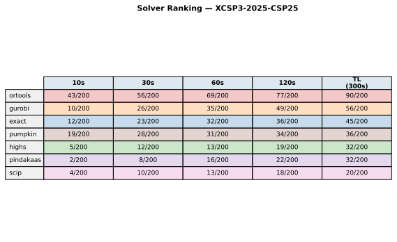

#### Solve Status

| Solver | SAT | UNSAT | TIMEOUT | OOM | ERROR | UNKNOWN | TOTAL |
|--------|-----|-------|---------|-----|-------|---------|-------|
| `ortools` | 76 | 25 | 5 | **10** | **14** | 70 | 200 |
| `cpo` | 63 | 9 | 9 | **6** | **14** | 99 | 200 |
| `gurobi` | 39 | 22 | 49 | **11** | **14** | 65 | 200 |
| `exact` | 39 | 13 | 88 | **12** | **14** | 34 | 200 |
| `pumpkin` | 37 | 5 | 29 | **7** | **25** | 97 | 200 |
| `pindakaas` | 25 | 13 | 34 | **61** | **14** | 53 | 200 |
| `highs` | 25 | 10 | 65 | **16** | **14** | 70 | 200 |
| `scip` | 14 | 10 | 53 | **36** | **17** | 70 | 200 |

#### Solution Checker

| Solver | Valid | Invalid | Skipped | Total |
|--------|-------|---------|---------|-------|
| `ortools` | 174 | 0 | 26 | 200 |
| `cpo` | 174 | 0 | 26 | 200 |
| `gurobi` | 151 | 0 | 49 | 200 |
| `exact` | 97 | 0 | 103 | 200 |
| `pumpkin` | 168 | 0 | 32 | 200 |
| `pindakaas` | 96 | 0 | 104 | 200 |
| `highs` | 115 | 0 | 85 | 200 |
| `scip` | 105 | 0 | 95 | 200 |

---

## Simplify bool

_Tracks: XCSP3-2025-CSP25 · cpmpy: `36447b7f — remove trailing comma` · Created: 2026-06-01 15:53:46 · Last run: 2026-06-01 21:09:19_

### Track: XCSP3-2025-CSP25

#### Performance Profile

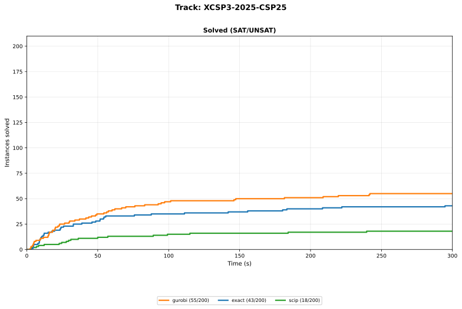

#### Solver Ranking

#### Solve Status

| Solver | SAT | UNSAT | TIMEOUT | OOM | ERROR | UNKNOWN | TOTAL |
|--------|-----|-------|---------|-----|-------|---------|-------|
| `ortools` | 76 | 24 | 5 | **10** | **14** | 71 | 200 |
| `gurobi` | 38 | 21 | 51 | **9** | **14** | 67 | 200 |
| `exact` | 39 | 13 | 95 | **11** | **14** | 28 | 200 |
| `highs` | 25 | 11 | 64 | **16** | **14** | 70 | 200 |
| `scip` | 12 | 9 | 62 | **34** | **14** | 69 | 200 |

#### Solution Checker

| Solver | Valid | Invalid | Skipped | Total |
|--------|-------|---------|---------|-------|
| `ortools` | 174 | 0 | 26 | 200 |
| `gurobi` | 155 | 0 | 45 | 200 |
| `exact` | 87 | 0 | 113 | 200 |
| `highs` | 114 | 0 | 86 | 200 |
| `scip` | 105 | 0 | 95 | 200 |

---

## Reduce MDD - rerun

_Tracks: XCSP3-2025-CSP25 · cpmpy: `7a2345fa — Merge remote-tracking branch 'origin/master' into xcsp3_26` · Created: 2026-06-01 13:08:07 · Last run: 2026-06-01 15:40:06_

### Track: XCSP3-2025-CSP25

#### Performance Profile

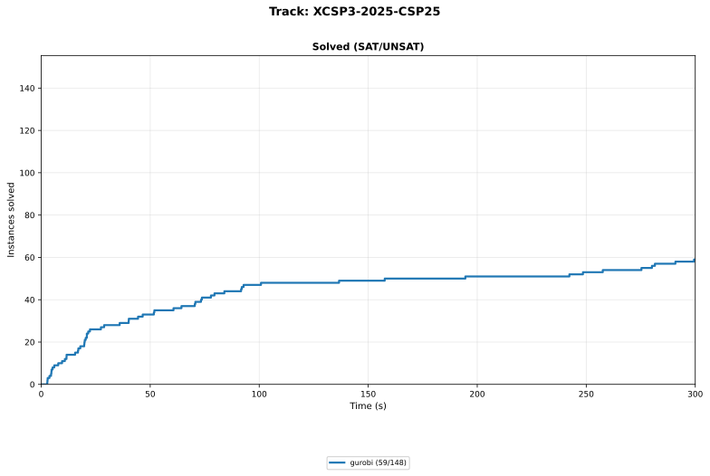

#### Solver Ranking

#### Solve Status

| Solver | SAT | UNSAT | TIMEOUT | OOM | ERROR | UNKNOWN | TOTAL |
|--------|-----|-------|---------|-----|-------|---------|-------|
| `ortools` | 75 | 24 | 2 | **12** | **14** | 73 | 200 |
| `gurobi` | 39 | 22 | 48 | **12** | **14** | 65 | 200 |
| `exact` | 39 | 13 | 86 | **15** | **14** | 33 | 200 |
| `scip` | 12 | 10 | 51 | **40** | **18** | 69 | 200 |

#### Solution Checker

| Solver | Valid | Invalid | Skipped | Total |
|--------|-------|---------|---------|-------|
| `ortools` | 174 | 0 | 26 | 200 |
| `gurobi` | 148 | 0 | 52 | 200 |
| `exact` | 95 | 0 | 105 | 200 |
| `scip` | 109 | 0 | 91 | 200 |

---

## Per-table type linear decompose

_Tracks: XCSP3-2025-CSP25 · cpmpy: `d6eff956 — Per-table type  linear decompose` · Created: 2026-06-01 10:29:03 · Last run: 2026-06-01 12:31:23_

### Track: XCSP3-2025-CSP25

#### Performance Profile

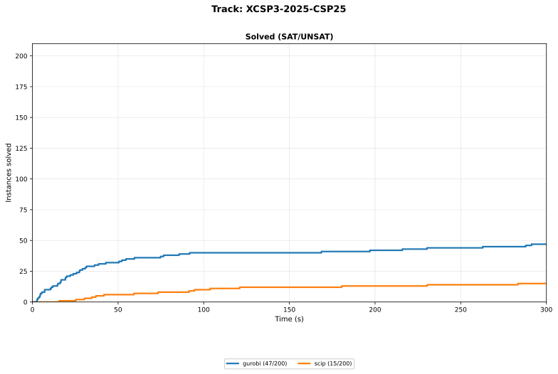

#### Solver Ranking

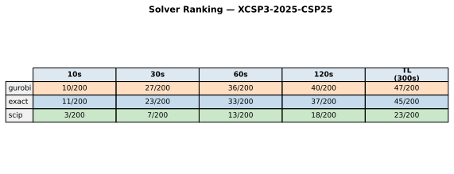

#### Solve Status

| Solver | SAT | UNSAT | TIMEOUT | OOM | ERROR | UNKNOWN | TOTAL |
|--------|-----|-------|---------|-----|-------|---------|-------|
| `exact` | 39 | 13 | 91 | **15** | **14** | 28 | 200 |
| `gurobi` | 35 | 14 | 51 | **14** | **14** | 72 | 200 |
| `scip` | 16 | 9 | 65 | **36** | **17** | 57 | 200 |

#### Solution Checker

| Solver | Valid | Invalid | Skipped | Total |
|--------|-------|---------|---------|-------|
| `exact` | 86 | 0 | 114 | 200 |
| `gurobi` | 147 | 0 | 53 | 200 |
| `scip` | 107 | 0 | 93 | 200 |

---

## Reduce MDD

_Tracks: XCSP3-2025-CSP25, unknown · cpmpy: `—` · Created: 2026-06-01 09:39:26 · Last run: 2026-06-01 10:09:02_

### Track: XCSP3-2025-CSP25

#### Performance Profile

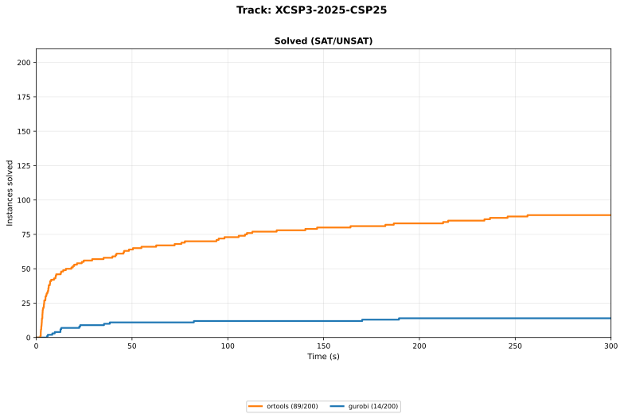

#### Solver Ranking

#### Solve Status

| Solver | SAT | UNSAT | TIMEOUT | OOM | ERROR | UNKNOWN | TOTAL |
|--------|-----|-------|---------|-----|-------|---------|-------|
| `ortools` | 77 | 25 | 2 | **12** | **14** | 70 | 200 |
| `gurobi` | 25 | 14 | 3 | **9** | **53** | 37 | 141 |

#### Solution Checker

| Solver | Valid | Invalid | Skipped | Total |
|--------|-------|---------|---------|-------|
| `ortools` | 174 | 0 | 26 | 200 |
| `gurobi` | 77 | 0 | 64 | 141 |

### Track: unknown

#### Performance Profile

#### Solver Ranking

#### Solve Status

_No results yet._

#### Solution Checker

_Solution checker not enabled._

---

## Order encoding for inequalities - long

_Tracks: XCSP3-2025-CSP25 · cpmpy: `e3f20354 — Test: Force cumulative time for linear decompose` · Created: 2026-05-31 22:29:41 · Last run: 2026-06-01 03:44:37_

### Track: XCSP3-2025-CSP25

#### Performance Profile

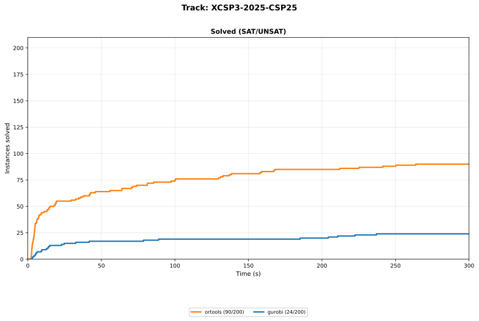

#### Solver Ranking

#### Solve Status

| Solver | SAT | UNSAT | TIMEOUT | OOM | ERROR | UNKNOWN | TOTAL |
|--------|-----|-------|---------|-----|-------|---------|-------|
| `ortools` | 78 | 26 | 2 | **12** | **14** | 68 | 200 |
| `gurobi` | 29 | 16 | 16 | **17** | **67** | 55 | 200 |
| `exact` | 29 | 12 | 47 | **16** | **67** | 29 | 200 |
| `scip` | 11 | 11 | 34 | **24** | **70** | 50 | 200 |

#### Solution Checker

| Solver | Valid | Invalid | Skipped | Total |
|--------|-------|---------|---------|-------|
| `ortools` | 174 | 0 | 26 | 200 |
| `gurobi` | 114 | 0 | 86 | 200 |
| `exact` | 71 | 0 | 129 | 200 |
| `scip` | 76 | 0 | 124 | 200 |

---

## Some transformation improvements - long

_Tracks: XCSP3-2025-CSP25 · cpmpy: `6e268bb7 — Merge remote-tracking branch 'origin/master' into xcsp3_26` · Created: 2026-05-29 18:48:40 · Last run: 2026-05-30 01:11:34_

### Track: XCSP3-2025-CSP25

#### Performance Profile

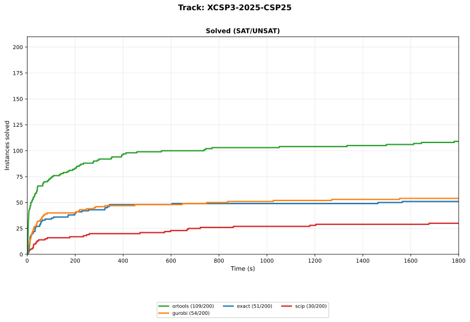

#### Solver Ranking

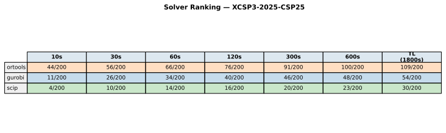

#### Solve Status

| Solver | SAT | UNSAT | TIMEOUT | OOM | ERROR | UNKNOWN | TOTAL |
|--------|-----|-------|---------|-----|-------|---------|-------|
| `ortools` | 82 | 27 | 2 | **12** | **14** | 63 | 200 |
| `gurobi` | 38 | 16 | 42 | **33** | **14** | 57 | 200 |
| `exact` | 39 | 13 | 91 | **23** | **14** | 20 | 200 |
| `scip` | 18 | 12 | 60 | **44** | **16** | 50 | 200 |

#### Solution Checker

| Solver | Valid | Invalid | Skipped | Total |
|--------|-------|---------|---------|-------|
| `ortools` | 174 | 0 | 26 | 200 |
| `gurobi` | 146 | 0 | 54 | 200 |
| `exact` | 83 | 0 | 117 | 200 |
| `scip` | 94 | 0 | 106 | 200 |

---

## Order encoding for inequalities

_Tracks: XCSP3-2025-CSP25 · cpmpy: `e3f20354 — Test: Force cumulative time for linear decompose` · Created: 2026-05-29 13:59:57 · Last run: 2026-05-29 18:03:17_

### Track: XCSP3-2025-CSP25

#### Performance Profile

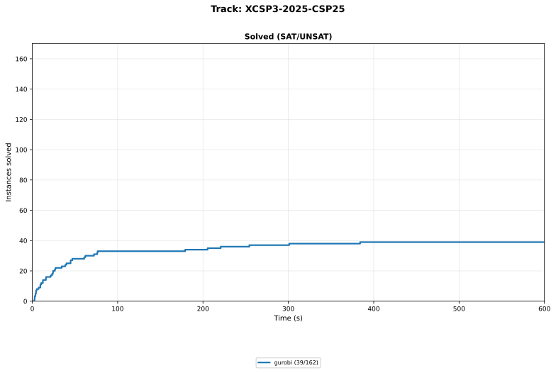

#### Solver Ranking

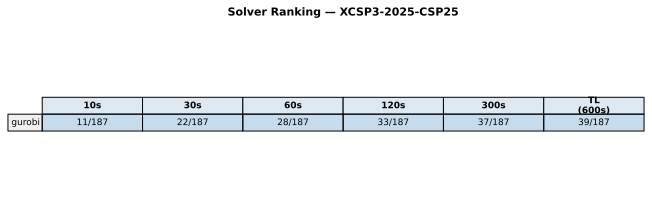

#### Solve Status

| Solver | SAT | UNSAT | TIMEOUT | OOM | ERROR | UNKNOWN | TOTAL |
|--------|-----|-------|---------|-----|-------|---------|-------|
| `exact` | 28 | 11 | 51 | **12** | **67** | 31 | 200 |
| `gurobi` | 25 | 14 | 25 | **10** | **67** | 59 | 200 |
| `scip` | 10 | 10 | 44 | **19** | **70** | 47 | 200 |

#### Solution Checker

| Solver | Valid | Invalid | Skipped | Total |
|--------|-------|---------|---------|-------|
| `exact` | 72 | 0 | 128 | 200 |
| `gurobi` | 108 | 0 | 92 | 200 |
| `scip` | 78 | 0 | 122 | 200 |

---

## NoOverlap via Cumulative linear decomp

_Tracks: XCSP3-2025-CSP25 · cpmpy: `4566ba81 — Test: linear decomp nooverlap via cumulative` · Created: 2026-05-29 10:57:41 · Last run: 2026-05-29 17:22:33_

### Track: XCSP3-2025-CSP25

#### Performance Profile

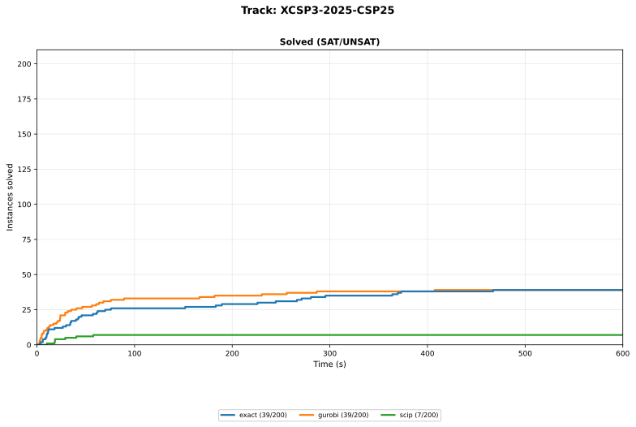

#### Solver Ranking

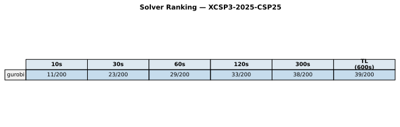

#### Solve Status

| Solver | SAT | UNSAT | TIMEOUT | OOM | ERROR | UNKNOWN | TOTAL |
|--------|-----|-------|---------|-----|-------|---------|-------|
| `exact` | 28 | 11 | 46 | **13** | **67** | 35 | 200 |
| `gurobi` | 25 | 14 | 24 | **11** | **67** | 59 | 200 |
| `scip` | 10 | 8 | 42 | **20** | **70** | 50 | 200 |

#### Solution Checker

| Solver | Valid | Invalid | Skipped | Total |
|--------|-------|---------|---------|-------|
| `exact` | 79 | 0 | 121 | 200 |
| `gurobi` | 113 | 0 | 87 | 200 |
| `scip` | 79 | 0 | 121 | 200 |

---

## Positive MDD decomp

_Tracks: XCSP3-2025-CSP25 · cpmpy: `85556f00 — Positive MDD test` · Created: 2026-05-29 09:27:01 · Last run: 2026-05-29 09:57:51_

### Track: XCSP3-2025-CSP25

#### Performance Profile

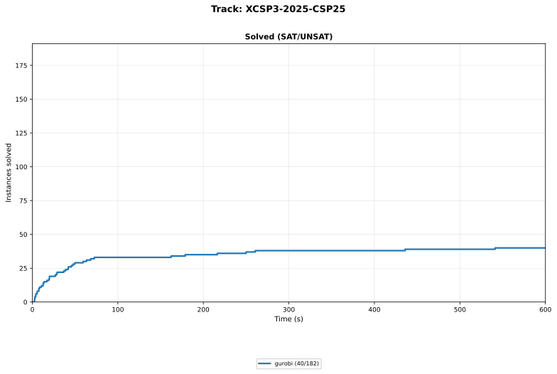

#### Solver Ranking

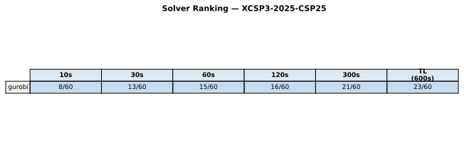

#### Solve Status

| Solver | SAT | UNSAT | TIMEOUT | OOM | ERROR | UNKNOWN | TOTAL |
|--------|-----|-------|---------|-----|-------|---------|-------|
| `gurobi` | 25 | 15 | 21 | **10** | **67** | 62 | 200 |

#### Solution Checker

| Solver | Valid | Invalid | Skipped | Total |
|--------|-------|---------|---------|-------|
| `gurobi` | 113 | 0 | 87 | 200 |

---

## Some transformation improvements - rerun

_Tracks: XCSP3-2025-CSP25 · cpmpy: `6e268bb7 — Merge remote-tracking branch 'origin/master' into xcsp3_26` · Created: 2026-05-28 16:55:01 · Last run: 2026-05-29 00:03:40_

### Track: XCSP3-2025-CSP25

#### Performance Profile

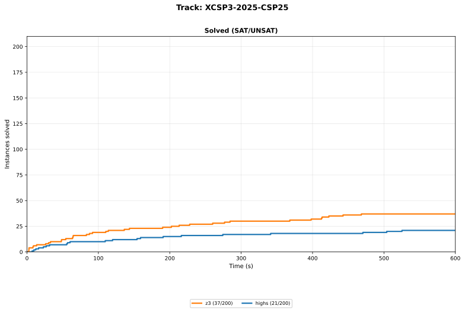

#### Solver Ranking

#### Solve Status

| Solver | SAT | UNSAT | TIMEOUT | OOM | ERROR | UNKNOWN | TOTAL |
|--------|-----|-------|---------|-----|-------|---------|-------|
| `z3` | 24 | 13 | 26 | **16** | **14** | 107 | 200 |
| `highs` | 21 | 10 | 68 | **19** | **14** | 68 | 200 |

#### Solution Checker

| Solver | Valid | Invalid | Skipped | Total |
|--------|-------|---------|---------|-------|
| `z3` | 163 | 0 | 37 | 200 |
| `highs` | 106 | 0 | 94 | 200 |

---

## Table with MDD decomp

_Tracks: XCSP3-2025-CSP25 · cpmpy: `3ed0f343 — Table global from master used in competition branch (to be able to use MDD decomposition)` · Created: 2026-05-28 16:47:14 · Last run: 2026-05-29 05:10:05_

### Track: XCSP3-2025-CSP25

#### Performance Profile

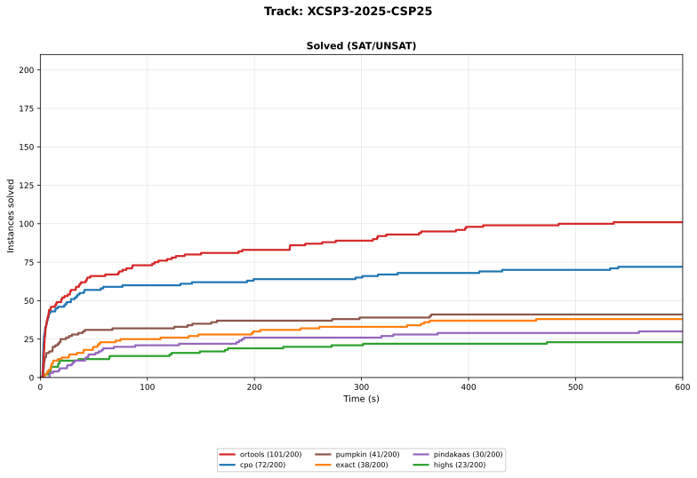

#### Solver Ranking

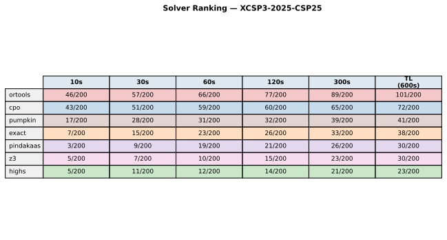

#### Solve Status

| Solver | SAT | UNSAT | TIMEOUT | OOM | ERROR | UNKNOWN | TOTAL |
|--------|-----|-------|---------|-----|-------|---------|-------|
| `ortools` | 76 | 25 | 2 | **12** | **14** | 71 | 200 |
| `cpo` | 63 | 9 | 10 | **6** | **14** | 98 | 200 |
| `pumpkin` | 36 | 5 | 28 | **7** | **25** | 99 | 200 |
| `exact` | 27 | 11 | 52 | **12** | **67** | 31 | 200 |
| `gurobi` | 24 | 14 | 25 | **11** | **67** | 59 | 200 |
| `z3` | 25 | 13 | 14 | **14** | **14** | 120 | 200 |
| `pindakaas` | 17 | 13 | 7 | **56** | **67** | 40 | 200 |
| `highs` | 13 | 10 | 34 | **12** | **67** | 64 | 200 |
| `scip` | 8 | 8 | 43 | **19** | **69** | 53 | 200 |

#### Solution Checker

| Solver | Valid | Invalid | Skipped | Total |
|--------|-------|---------|---------|-------|
| `ortools` | 174 | 0 | 26 | 200 |
| `cpo` | 173 | 0 | 27 | 200 |
| `pumpkin` | 168 | 0 | 32 | 200 |
| `exact` | 76 | 0 | 124 | 200 |
| `gurobi` | 110 | 0 | 90 | 200 |
| `z3` | 166 | 0 | 34 | 200 |
| `pindakaas` | 73 | 0 | 127 | 200 |
| `highs` | 93 | 0 | 107 | 200 |
| `scip` | 80 | 0 | 120 | 200 |

---

## Some transformation improvements

_Tracks: XCSP3-2025-CSP25 · cpmpy: `6e268bb7 — Merge remote-tracking branch 'origin/master' into xcsp3_26` · Created: 2026-05-28 10:26:53 · Last run: 2026-05-28 15:47:34_

### Track: XCSP3-2025-CSP25

#### Performance Profile

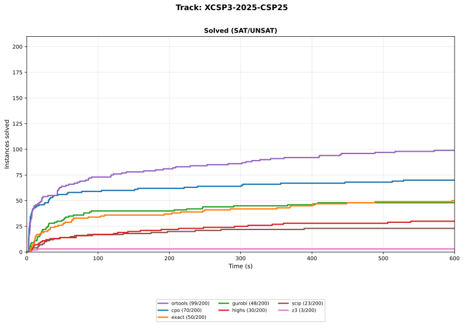

#### Solver Ranking

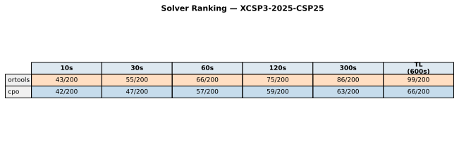

#### Solve Status

| Solver | SAT | UNSAT | TIMEOUT | OOM | ERROR | UNKNOWN | TOTAL |
|--------|-----|-------|---------|-----|-------|---------|-------|
| `ortools` | 75 | 24 | 2 | **12** | **14** | 73 | 200 |
| `cpo` | 62 | 8 | 9 | **6** | **14** | 101 | 200 |
| `exact` | 37 | 13 | 99 | **14** | **14** | 23 | 200 |
| `gurobi` | 34 | 14 | 70 | **8** | **14** | 60 | 200 |
| `pumpkin` | 36 | 6 | 29 | **7** | **25** | 97 | 200 |
| `z3` | 24 | 13 | 31 | **9** | **14** | 109 | 200 |
| `pindakaas` | 24 | 12 | 35 | **61** | **14** | 54 | 200 |
| `highs` | 20 | 10 | 70 | **19** | **14** | 67 | 200 |
| `scip` | 14 | 9 | 76 | **34** | **16** | 51 | 200 |

#### Solution Checker

| Solver | Valid | Invalid | Skipped | Total |
|--------|-------|---------|---------|-------|
| `ortools` | 174 | 0 | 26 | 200 |
| `cpo` | 173 | 0 | 27 | 200 |
| `exact` | 87 | 0 | 113 | 200 |
| `gurobi` | 151 | 0 | 49 | 200 |
| `pumpkin` | 168 | 0 | 32 | 200 |
| `z3` | 163 | 0 | 37 | 200 |
| `pindakaas` | 98 | 0 | 102 | 200 |
| `highs` | 105 | 0 | 95 | 200 |
| `scip` | 89 | 0 | 111 | 200 |

---

## Use new MDD global in xcsp3 parser

_Tracks: XCSP3-2025-COP25, XCSP3-2025-CSP25 · cpmpy: `—` · Created: 2026-05-27 09:08:46 · Last run: 2026-05-27 20:08:47_

### Track: XCSP3-2025-CSP25

#### Performance Profile

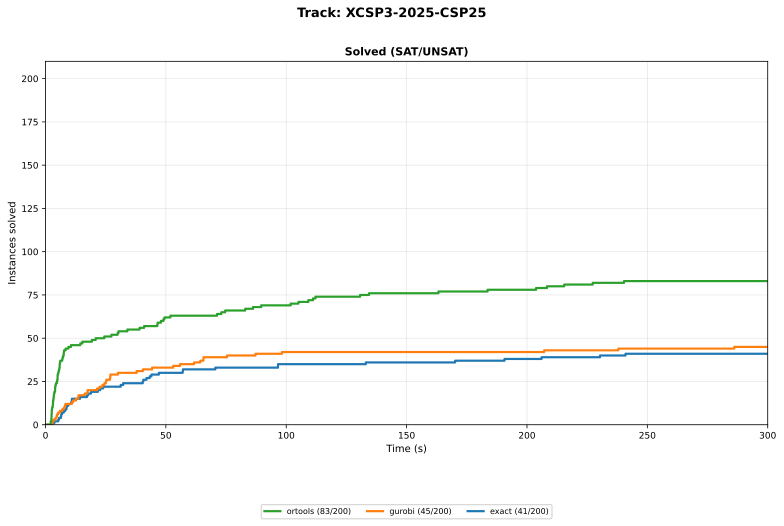

#### Solver Ranking

#### Solve Status

| Solver | SAT | UNSAT | TIMEOUT | OOM | ERROR | UNKNOWN | TOTAL |
|--------|-----|-------|---------|-----|-------|---------|-------|
| `ortools` | 74 | 24 | 5 | **11** | **14** | 72 | 200 |
| `cpo` | 62 | 9 | 12 | **6** | **14** | 97 | 200 |
| `exact` | 35 | 12 | 99 | **13** | **14** | 27 | 200 |
| `gurobi` | 32 | 13 | 69 | **10** | **14** | 62 | 200 |
| `pumpkin` | 38 | 6 | 32 | **7** | **25** | 92 | 200 |
| `z3` | 26 | 12 | 29 | **11** | **14** | 108 | 200 |
| `pindakaas` | 23 | 12 | 34 | **62** | **14** | 55 | 200 |
| `highs` | 20 | 10 | 71 | **19** | **14** | 66 | 200 |
| `scip` | 11 | 8 | 69 | **32** | **16** | 64 | 200 |

#### Solution Checker

| Solver | Valid | Invalid | Skipped | Total |
|--------|-------|---------|---------|-------|
| `ortools` | 174 | 0 | 26 | 200 |
| `cpo` | 174 | 0 | 26 | 200 |
| `exact` | 85 | 0 | 115 | 200 |
| `gurobi` | 149 | 0 | 51 | 200 |
| `pumpkin` | 167 | 0 | 33 | 200 |
| `z3` | 159 | 0 | 41 | 200 |
| `pindakaas` | 98 | 0 | 102 | 200 |
| `highs` | 106 | 0 | 94 | 200 |
| `scip` | 97 | 0 | 103 | 200 |

### Track: XCSP3-2025-COP25

#### Performance Profile

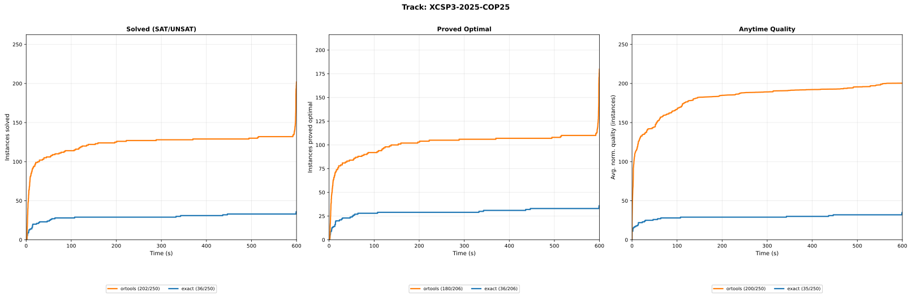

#### Solver Ranking

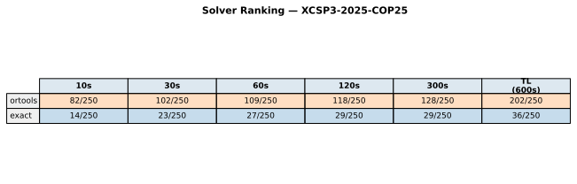

#### Solve Status

| Solver | SAT | UNSAT | TIMEOUT | OOM | ERROR | UNKNOWN | TOTAL |
|--------|-----|-------|---------|-----|-------|---------|-------|
| `ortools` | 202 | 22 | 5 | **13** | 0 | 8 | 250 |
| `cpo` | 164 | 20 | 36 | **16** | 0 | 14 | 250 |
| `gurobi` | 148 | 17 | 52 | **14** | 0 | 19 | 250 |
| `highs` | 113 | 12 | 75 | **29** | 0 | 21 | 250 |
| `scip` | 97 | 14 | 68 | **41** | **8** | 22 | 250 |
| `z3` | 94 | 16 | 54 | **26** | **17** | 43 | 250 |
| `exact` | 88 | 17 | 122 | **17** | 0 | 6 | 250 |
| `pumpkin` | 102 | 1 | 24 | **25** | **63** | 35 | 250 |

#### Solution Checker

| Solver | Valid | Invalid | Skipped | Total |
|--------|-------|---------|---------|-------|
| `ortools` | 228 | 0 | 22 | 250 |
| `cpo` | 192 | 0 | 58 | 250 |
| `gurobi` | 191 | 0 | 59 | 250 |
| `highs` | 162 | 0 | 88 | 250 |
| `scip` | 142 | 0 | 108 | 250 |
| `z3` | 175 | 0 | 75 | 250 |
| `exact` | 107 | 0 | 143 | 250 |
| `pumpkin` | 153 | 0 | 97 | 250 |

---

## MDD global

_Tracks: XCSP3-2025-COP25, XCSP3-2025-CSP25 · cpmpy: `—` · Created: 2026-05-26 16:50:39 · Last run: 2026-05-27 09:05:54_

### Track: XCSP3-2025-CSP25

#### Performance Profile

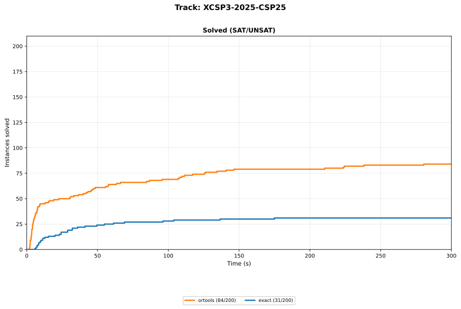

#### Solver Ranking

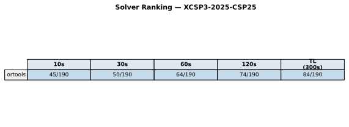

#### Solve Status

| Solver | SAT | UNSAT | TIMEOUT | OOM | ERROR | UNKNOWN | TOTAL |
|--------|-----|-------|---------|-----|-------|---------|-------|
| `ortools` | 73 | 24 | 4 | **12** | **14** | 73 | 200 |
| `cpo` | 61 | 8 | 11 | **6** | **14** | 100 | 200 |
| `exact` | 35 | 12 | 101 | **13** | **14** | 25 | 200 |
| `gurobi` | 32 | 13 | 68 | **10** | **14** | 63 | 200 |
| `pumpkin` | 38 | 6 | 30 | **7** | **25** | 94 | 200 |
| `z3` | 27 | 12 | 34 | **9** | **14** | 104 | 200 |
| `pindakaas` | 23 | 12 | 36 | **63** | **14** | 52 | 200 |
| `highs` | 21 | 10 | 71 | **19** | **14** | 65 | 200 |
| `scip` | 14 | 8 | 77 | **32** | **16** | 53 | 200 |

#### Solution Checker

| Solver | Valid | Invalid | Skipped | Total |
|--------|-------|---------|---------|-------|
| `ortools` | 174 | 0 | 26 | 200 |
| `cpo` | 173 | 0 | 27 | 200 |
| `exact` | 86 | 0 | 114 | 200 |
| `gurobi` | 146 | 0 | 54 | 200 |
| `pumpkin` | 168 | 0 | 32 | 200 |
| `z3` | 160 | 0 | 40 | 200 |
| `pindakaas` | 96 | 0 | 104 | 200 |
| `highs` | 110 | 0 | 90 | 200 |
| `scip` | 93 | 0 | 107 | 200 |

### Track: XCSP3-2025-COP25

#### Performance Profile

#### Solver Ranking

#### Solve Status

| Solver | SAT | UNSAT | TIMEOUT | OOM | ERROR | UNKNOWN | TOTAL |
|--------|-----|-------|---------|-----|-------|---------|-------|
| `ortools` | 7 | 0 | 0 | 0 | 0 | 0 | 7 |

#### Solution Checker

| Solver | Valid | Invalid | Skipped | Total |
|--------|-------|---------|---------|-------|
| `ortools` | 7 | 0 | 0 | 7 |

---

## linearize_reified_variables for OR-Tools

_Tracks: XCSP3-2025-COP25, XCSP3-2025-CSP25 · cpmpy: `—` · Created: 2026-05-26 13:50:16 · Last run: 2026-05-26 16:38:08_

### Track: XCSP3-2025-COP25

#### Performance Profile

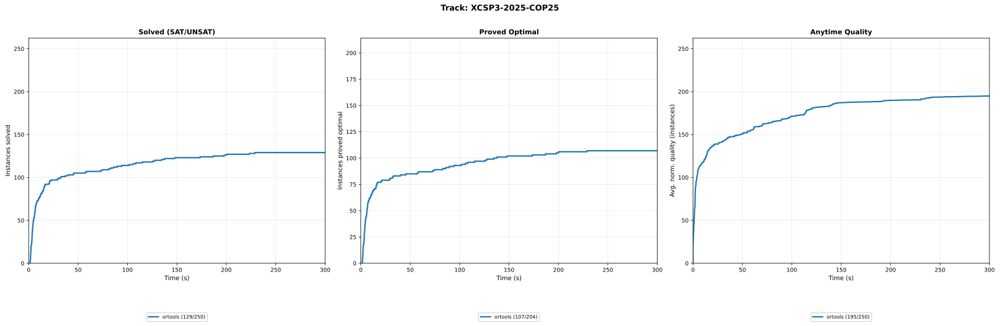

#### Solver Ranking

#### Solve Status

| Solver | SAT | UNSAT | TIMEOUT | OOM | ERROR | UNKNOWN | TOTAL |
|--------|-----|-------|---------|-----|-------|---------|-------|
| `ortools` | 203 | 22 | 2 | **13** | 0 | 10 | 250 |

#### Solution Checker

| Solver | Valid | Invalid | Skipped | Total |
|--------|-------|---------|---------|-------|
| `ortools` | 229 | 0 | 21 | 250 |

### Track: XCSP3-2025-CSP25

#### Performance Profile

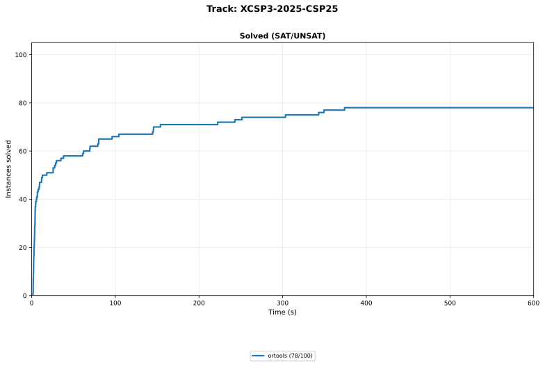

#### Solver Ranking

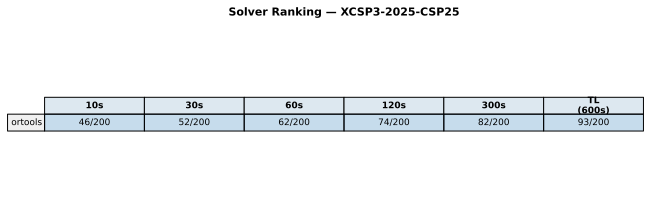

#### Solve Status

| Solver | SAT | UNSAT | TIMEOUT | OOM | ERROR | UNKNOWN | TOTAL |
|--------|-----|-------|---------|-----|-------|---------|-------|
| `ortools` | 72 | 24 | 2 | **12** | **14** | 76 | 200 |

#### Solution Checker

| Solver | Valid | Invalid | Skipped | Total |
|--------|-------|---------|---------|-------|
| `ortools` | 171 | **3** | 26 | 200 |

---

## baseline

_Tracks: XCSP3-2025-COP25, XCSP3-2025-CSP25 · cpmpy: `45fc0181 — Deprecate old runner` · Created: 2026-05-21 16:23:19 · Last run: 2026-05-26 15:47:47_

### Track: XCSP3-2025-CSP25

#### Performance Profile

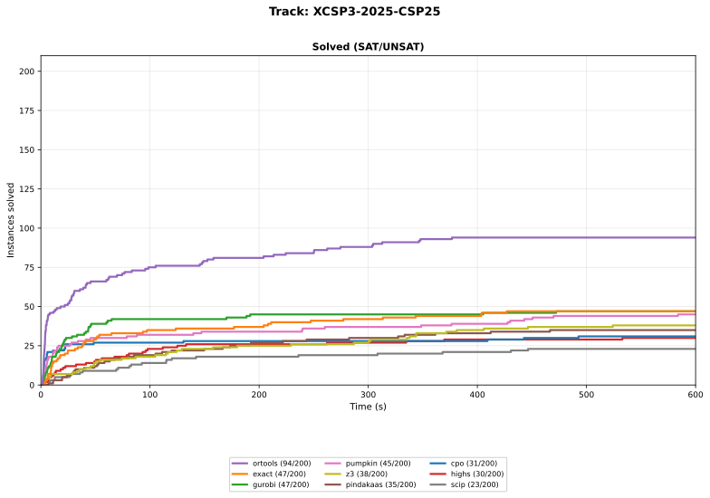

#### Solver Ranking

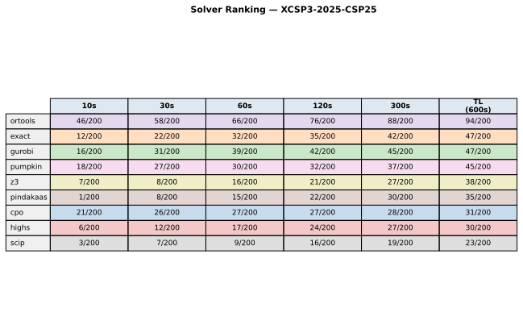

#### Solve Status

| Solver | SAT | UNSAT | TIMEOUT | OOM | ERROR | UNKNOWN | TOTAL |
|--------|-----|-------|---------|-----|-------|---------|-------|
| `ortools` | 73 | 24 | 4 | **12** | **14** | 73 | 200 |
| `exact` | 35 | 12 | 96 | **15** | **14** | 28 | 200 |
| `gurobi` | 33 | 14 | 55 | **18** | **14** | 66 | 200 |
| `pumpkin` | 38 | 7 | 25 | **7** | **25** | 98 | 200 |
| `z3` | 26 | 12 | 32 | **10** | **14** | 106 | 200 |
| `pindakaas` | 23 | 12 | 38 | **62** | **14** | 51 | 200 |
| `cpo` | 26 | 5 | 1 | **6** | **119** | 43 | 200 |
| `highs` | 20 | 10 | 71 | **19** | **14** | 66 | 200 |
| `scip` | 15 | 8 | 71 | **33** | **18** | 55 | 200 |

#### Solution Checker

| Solver | Valid | Invalid | Skipped | Total |
|--------|-------|---------|---------|-------|
| `ortools` | 171 | **3** | 26 | 200 |
| `exact` | 0 | 0 | 200 | 200 |
| `gurobi` | 153 | 0 | 47 | 200 |
| `pumpkin` | 0 | 0 | 200 | 200 |
| `z3` | 0 | 0 | 200 | 200 |
| `pindakaas` | 0 | 0 | 200 | 200 |
| `cpo` | 75 | 0 | 125 | 200 |
| `highs` | 0 | 0 | 200 | 200 |
| `scip` | 0 | 0 | 200 | 200 |

### Track: XCSP3-2025-COP25

#### Performance Profile

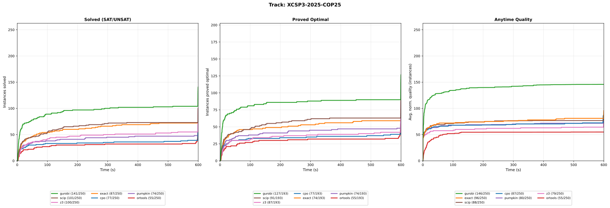

#### Solver Ranking

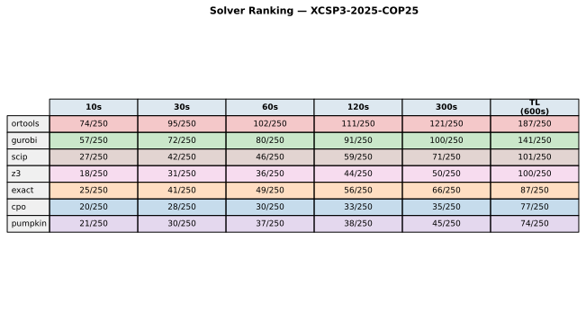

#### Solve Status

| Solver | SAT | UNSAT | TIMEOUT | OOM | ERROR | UNKNOWN | TOTAL |
|--------|-----|-------|---------|-----|-------|---------|-------|
| `ortools` | 202 | 22 | 4 | **13** | 0 | 9 | 250 |
| `cpo` | 170 | 16 | 27 | **18** | **4** | 15 | 250 |
| `gurobi` | 149 | 14 | 31 | **33** | **4** | 19 | 250 |
| `highs` | 114 | 9 | 67 | **34** | **4** | 22 | 250 |
| `exact` | 97 | 13 | 99 | **34** | **4** | 3 | 250 |
| `z3` | 96 | 13 | 48 | **33** | **20** | 40 | 250 |
| `scip` | 98 | 10 | 51 | **52** | **15** | 24 | 250 |
| `pumpkin` | 103 | 0 | 21 | **25** | **65** | 36 | 250 |

#### Solution Checker

| Solver | Valid | Invalid | Skipped | Total |
|--------|-------|---------|---------|-------|
| `ortools` | 228 | 0 | 22 | 250 |
| `cpo` | 193 | **4** | 53 | 250 |
| `gurobi` | 189 | **2** | 59 | 250 |
| `highs` | 165 | 0 | 85 | 250 |
| `exact` | 107 | **1** | 142 | 250 |
| `z3` | 174 | **2** | 74 | 250 |
| `scip` | 143 | 0 | 107 | 250 |
| `pumpkin` | 151 | **2** | 97 | 250 |

---

## Submission 2025

_Tracks: XCSP3-2025-CSP25 · cpmpy: `1e446eaf — Add count to second decompose_numerical location` · Created: 2026-05-22 12:57:37 · Last run: 2026-05-22 22:44:59_

### Track: XCSP3-2025-CSP25

#### Performance Profile

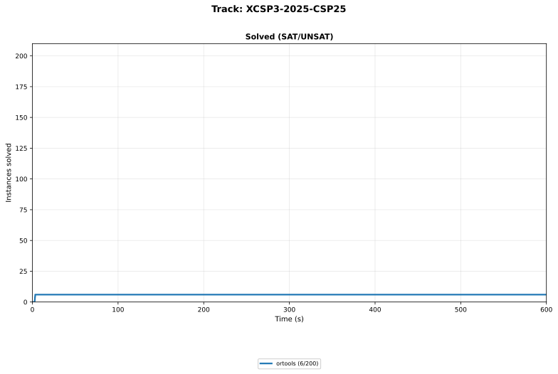

#### Solver Ranking

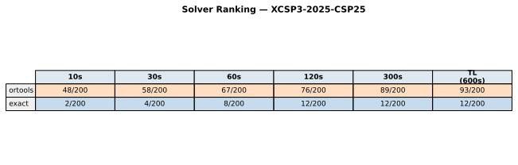

#### Solve Status

| Solver | SAT | UNSAT | TIMEOUT | OOM | ERROR | UNKNOWN | TOTAL |
|--------|-----|-------|---------|-----|-------|---------|-------|
| `ortools` | 72 | 21 | 1 | **10** | **39** | 57 | 200 |
| `z3` | 23 | 13 | 6 | **9** | **80** | 69 | 200 |
| `gurobi` | 20 | 12 | 15 | **9** | **81** | 63 | 200 |
| `cpo` | 21 | 5 | 1 | **6** | **126** | 41 | 200 |
| `exact` | 20 | 3 | 38 | **9** | **106** | 24 | 200 |
| `pumpkin` | 0 | 0 | 0 | **2** | **198** | 0 | 200 |
| `scip` | 0 | 0 | 0 | **2** | **198** | 0 | 200 |

#### Solution Checker

| Solver | Valid | Invalid | Skipped | Total |
|--------|-------|---------|---------|-------|
| `ortools` | 79 | 0 | 121 | 200 |
| `z3` | 83 | 0 | 117 | 200 |
| `gurobi` | 81 | 0 | 119 | 200 |
| `cpo` | 47 | 0 | 153 | 200 |
| `exact` | 30 | 0 | 170 | 200 |
| `pumpkin` | 0 | 0 | 200 | 200 |
| `scip` | 0 | 0 | 200 | 200 |
